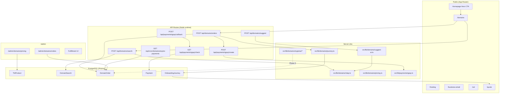
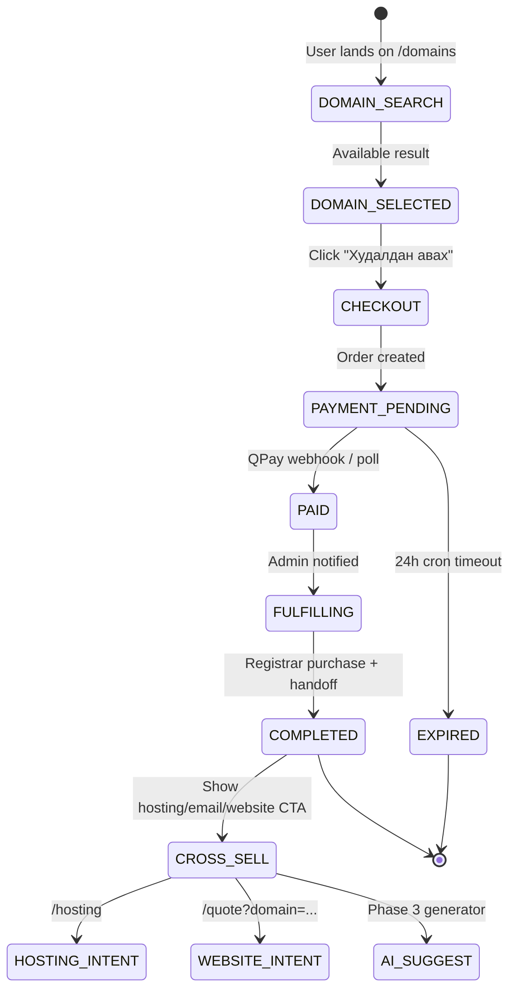
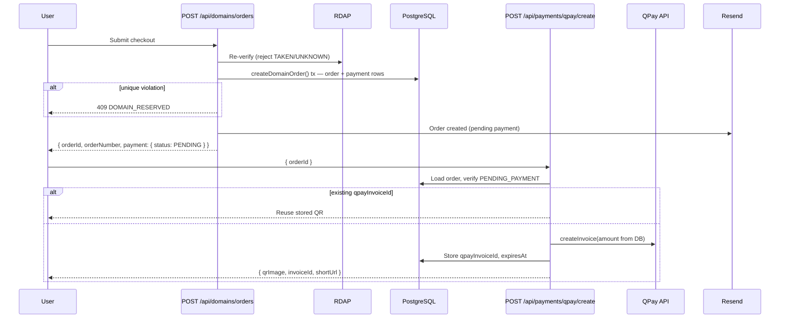
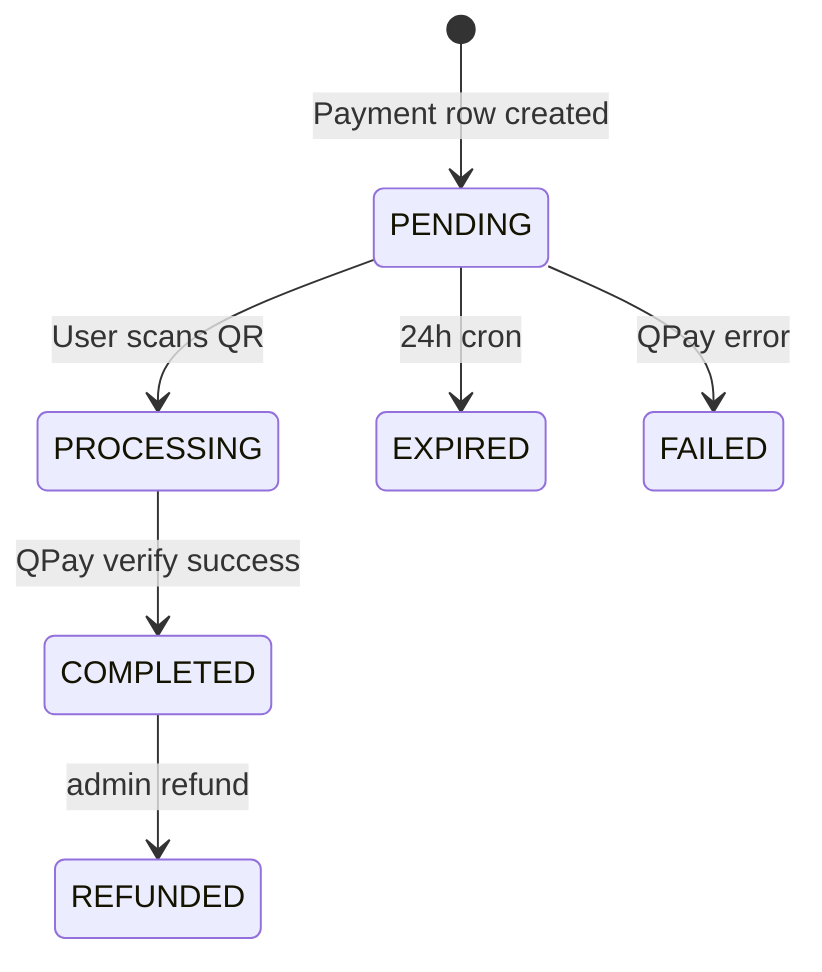

# Nuul Digital Domains Module & "10-Minute Online" Platform

| Field | Value |
|---|---|
| **Author** | Systems Architecture (Draft) |
| **Date** | July 7, 2026 |
| **Status** | Draft (rev. 2.1 — re-review) |
| **Primary codebase** | `C:\Users\User\nuul-digital` |
| **Reference (patterns only)** | `C:\Users\User\nuul dijital` |
| **Production domain** | https://nuul.digital |

---

## Overview

Nuul Digital is evolving from a premium digital agency CMS into a **unified growth platform**: AI + Website + Automation + Digital Growth Agency. Domain registration is not a standalone product—it is **Step 1** in a service funnel that ultimately delivers "Монголын бизнесийг 10 минутын дотор онлайнаар гаргадаг платформ" (get Mongolian businesses online in 10 minutes).

This document specifies the **Domains Module** and its integration with the existing Next.js 15 App Router stack (`prisma/schema.prisma`, `src/lib/rbac.ts`, `src/lib/security.ts`, `src/lib/mail.ts`, `/admin/*`). Phase 1 ships **search + manual fulfillment** (no registrar API). Later phases add hosting/email/SSL, AI name generation, customer accounts, live service orders, and automated reseller integration.

The design reuses proven patterns from the legacy `nuul dijital` repo—RDAP availability (`apps/web/lib/domain-checker.ts`), order flow (`server/routers/domain.ts`), rule-based suggestions (`lib/domain-suggestions.ts`), and QPay (`lib/qpay.ts`)—adapted to nuul-digital's REST API + server action architecture (no tRPC).

---

## Background & Motivation

### Current state (`nuul-digital`)

| Area | Today | Gap |
|---|---|---|
| **Domain awareness** | `ProjectBrief.domainStatus` / `domainName` in quote wizard (`src/components/forms/quote-wizard.tsx`) | No live search, no purchase path |
| **Payments** | Mentioned in copy only ("Онлайн төлбөр (QPay)") | No payment models or APIs |
| **Admin** | Leads, briefs, contacts (`/admin/leads`, `/admin/briefs`) | No domain order queue |
| **AI** | `/api/chat` with Anthropic/OpenAI + fallback | Not wired to domain suggestions |
| **Public nav** | `src/lib/site.ts` — no `/domains` link; `navbar.tsx` uses `NAV_KEY` map | Funnel entry point missing |

### Pain points

1. **Fragmented journey**: Users who want a domain must leave Nuul, buy elsewhere, then return to `/quote`—high drop-off.
2. **No revenue capture at intent peak**: Domain search is the highest-intent moment; we lose it to GoDaddy/registrar.mn.
3. **Manual ops invisible**: Even manual fulfillment needs structured orders, payment proof, and admin workflow.
4. **Future stack blocked**: Hosting, email, AI website builder, and SEO all assume a owned domain—without a `DomainOrder` + `OnboardingJourney` spine, cross-sell is ad hoc.

### Strategic positioning

```
Domain Search → Domain Purchase → Hosting → Business Email → AI Website Builder
    → AI Logo → SEO → Google Maps → Facebook Page → AI Chatbot
```

Domain selling funds acquisition; the platform monetizes the full stack.

---

## Goals & Non-Goals

### Goals — phased roadmap

| Phase | Timeline | Deliverable |
|---|---|---|
| **Phase 1** | Month 1 | `/domains` search UI, RDAP check, TLD pricing, guest checkout, QPay + bank transfer, admin manual fulfillment, order expiration cron |
| **Phase 2** | Month 2 | `/hosting`, `/business-email`, `/ssl` landing + waitlist/order scaffolding |
| **Phase 3** | Month 3 | AI domain generator (`POST /api/domains/suggest`), funnel into quote/website builder |
| **Phase 4** | Month 4 | Customer account portal: order lookup (`/orders/lookup`), magic-link email auth, order history |
| **Phase 5** | Month 5 | Live hosting & business-email orders with payment + manual provisioning workflow |
| **Phase 6** | Month 6 | Reseller provider abstraction, auto-registration scaffolding, DNS management prep |

**`OnboardingJourney` step → phase mapping:**

| JourneyStep | Phase delivered |
|---|---|
| `DOMAIN_SEARCH`, `DOMAIN_PURCHASED` | Phase 1 |
| `HOSTING_SELECTED`, `EMAIL_CONFIGURED` (waitlist) | Phase 2 scaffolding; live orders Phase 5 |
| `WEBSITE_BRIEF`, `LOGO_GENERATED` | Phase 3–4 (AI + quote prefill) |
| `SEO_SETUP`, `MAPS_LISTED`, `SOCIAL_CONNECTED`, `CHATBOT_LIVE` | Post-Phase 5 growth services |
| `COMPLETED` | Phase 6+ unified dashboard |

**Cross-cutting goals:**
- MN/EN i18n via `next-intl` (`messages/mn.json`, `messages/en.json`)
- RBAC extension (`domains:*` permissions in `src/lib/rbac.ts`)
- **Production rate limiting via Upstash Redis** (Phase 1 GA blocker); in-memory fallback for local dev only
- Email notifications via `src/lib/mail.ts` (Resend)
- Activity audit via `src/lib/activity.ts`
- Mobile-first dark premium UI aligned with `src/lib/design-tokens.ts`

### Non-Goals (Phase 1)

- Automated registrar API for `.mn` (requires Mongolian registrar partnership—separate R&D)
- Customer account portal — **Phase 4** (Phase 1 is guest checkout + email receipts)
- DNS management UI — Phase 6
- SocialPay integration — design hook only; QPay is primary
- Replacing `/quote` wizard — domains complement it via deep links and `OnboardingJourney`

---

## Proposed Design

### High-level architecture



### Service funnel state machine



---

## UX/UI Design

### Design principles

Align with existing Nuul patterns:
- **Dark premium**: `bg-card`, `border-white/10`, `text-gradient-accent`, `card-glow` (see `/services`, `hero.tsx`)
- **Motion**: Framer Motion `Reveal`, `Magnetic`; respect `prefers-reduced-motion` (disable aurora/text-reveal loops)
- **Tokens**: `color.accent` (#2563EB), `radius["2xl"]` for cards, `shadow.glowAccent` on primary CTAs
- **Forms**: Multi-step patterns from `QuoteWizard` — progress bar, chip selects, inline validation
- **i18n**: All user strings in `messages/{mn,en}.json` under `pages.domains`, `domains`, `checkout`

### Page: `/domains` (Phase 1 — primary)

**Layout (mobile-first)**

```
┌─────────────────────────────────────────────┐
│ PageHeader                                   │
│ label: "Домэйн"                              │
│ title: "Таны бизнесийн <accent>домэйн</accent>"│
│ description: "10 минутад онлайн болох эхний алхам" │
├─────────────────────────────────────────────┤
│ ┌─────────────────────────────────────────┐ │
│ │ 🔍  [ mybusiness          ] [.mn ▼] [Хайх]│ │
│ └─────────────────────────────────────────┘ │
│ TLD chips: .mn  .com  .org  .net  .shop      │
├─────────────────────────────────────────────┤
│ RESULTS (after search)                       │
│ ┌─ mybusiness.mn ── ✅ Боломжтой ── 45,000₮/жил [Худалдан авах] │
│ ┌─ mybusiness.com ─ ❌ Авагдсан                              │
│ ┌─ other.mn ── ⚠️ Шалгаагүй ── [Дахин шалгах] (no Buy)       │
│ ...                                          │
├─────────────────────────────────────────────┤
│ Rule-based suggestions (if .mn taken)      │
│ [getmybusiness] [mybusiness-pro] ...         │
├─────────────────────────────────────────────┤
│ Growth stack teaser (static Phase 1)         │
│ Domain → Hosting → Email → Website → AI    │
├─────────────────────────────────────────────┤
│ FAQ accordion (domain registration in MN)    │
└─────────────────────────────────────────────┘
```

**Component tree**

| Component | Path | Responsibility |
|---|---|---|
| `DomainsPage` | `src/app/[locale]/domains/page.tsx` | Server page, metadata, i18n, feature-flag guard |
| `DomainSearchHero` | `src/components/domains/domain-search-hero.tsx` | PageHeader + search |
| `DomainSearchForm` | `src/components/domains/domain-search-form.tsx` | Input, TLD selector, debounce |
| `DomainResultList` | `src/components/domains/domain-result-list.tsx` | Results, skeleton, empty |
| `DomainResultRow` | `src/components/domains/domain-result-row.tsx` | Single TLD row + CTA |
| `DomainSuggestions` | `src/components/domains/domain-suggestions.tsx` | Rule-based chips (Phase 1) |
| `DomainCheckoutSheet` | `src/components/domains/domain-checkout-sheet.tsx` | Slide-over / modal checkout |
| `QPayPaymentModal` | `src/components/payments/qpay-payment-modal.tsx` | QR + deeplinks |
| `BankTransferInstructions` | `src/components/payments/bank-transfer-panel.tsx` | Fallback payment |
| `GrowthStackStrip` | `src/components/domains/growth-stack-strip.tsx` | Funnel visualization |

**UI states**

| State | Visual | Copy (MN) | Copy (EN) | Buy CTA |
|---|---|---|---|---|
| **Idle** | Empty results, subtle placeholder | "Домэйн нэрээ оруулаад хайна уу" | "Enter a name to search" | — |
| **Loading** | 5-row skeleton pulse | — | — | — |
| **Available** | Green badge, price, gradient CTA | "Боломжтой" | "Available" | **Enabled** |
| **Taken** | Muted row, red badge, no CTA | "Авагдсан" | "Taken" | Disabled |
| **Reserved** | Amber badge | "Захиалагдаж байна" | "Checkout in progress" | Disabled |
| **Invalid input** | Inline error below input | "Зөвхөн латин үсэг (a-z), тоо (0-9), зураас (-)" | "Use letters, numbers, hyphens only" | — |
| **Rate limited** | Toast + disabled search | "Хэт олон хүсэлт. Түр хүлээгээд дахин оролдоно уу." | (existing `security.ts` message) | — |
| **UNKNOWN (RDAP error)** | Amber/warning badge, no price emphasis | "Шалгаагүй" | "Unverified" | **Disabled** — show "Дахин шалгах" retry button only |
| **Checkout** | Sheet with contact fields | "Захиалга баталгаажуулах" | "Confirm your order" | — |
| **Payment pending** | QPay QR modal | "QPay-ээр төлнө үү" | "Pay with QPay" | — |
| **Payment success** | Confetti-lite + next steps | "Төлбөр амжилттай! Бид 24 цагт домэйнийг идэвхжүүлнэ." | "Payment received! We'll activate within 24h." | — |
| **Payment expired** | Retry CTA | "Төлбөрийн хугацаа дууссан" | "Payment window expired" | — |
| **Conflict (409)** | Toast | "Энэ домэйнийг өөр хэрэглэгч захиалж байна. Түр хүлээгээд дахин оролдоно уу." | "Someone else is checking out this domain." | — |

> **Policy (consistent):** `UNKNOWN` availability **never** enables purchase. Users must retry search until `AVAILABLE` or choose another name. This matches Key Decisions and prevents selling domains we cannot verify.

**Search interaction spec**

- Debounce: **600ms** (matches legacy `DomainSearch.tsx`)
- Min length: **2** chars (after sanitization)
- Sanitization (port from `domain-checker.ts`):
  ```typescript
  const clean = name.toLowerCase().trim()
    .replace(/[^a-z0-9-]/g, "")
    .replace(/^-+|-+$/g, "")
    .replace(/\.[^.]+$/, "");
  ```
- Default TLD focus: **`.mn`** (Mongolian market)
- Submit on Enter or button; mobile keyboard `enterKeyHint="search"`

**Checkout form fields (Phase 1 — guest)**

| Field | Required | Validation |
|---|---|---|
| `fullName` | ✓ | 2–100 chars |
| `email` | ✓ | RFC email (`z.string().email()`) |
| `phone` | ✓ | `phoneMnSchema` — see below |
| `company` | optional | Required when `registrantType === "BUSINESS"` |
| `years` | ✓ | 1–5 (Phase 1 cap) |
| `registrantType` | ✓ | `INDIVIDUAL` \| `BUSINESS` |
| `registrantAddress` | ✓ | Free text, min 10 chars (NIC.MN registrant requirement) |
| `registrantIdType` | ✓ if INDIVIDUAL | `PASSPORT` \| `NATIONAL_ID` \| `OTHER` |
| `registrantIdNumber` | ✓ if INDIVIDUAL | Collected at checkout; verified by admin before fulfillment |
| `businessRegNumber` | ✓ if BUSINESS | Mongolian company registration number |
| `acceptTerms` | ✓ | Checkbox linking to `/legal/terms` **and** `/legal/domain-registration` |
| `acceptRegistryPolicy` | ✓ | Checkbox: "registry.mn / NIC.MN бодлогыг зөвшөөрч байна" |

**Phone validation (shared helper)**

Add `src/lib/validations/phone.ts`:

```typescript
import { z } from "zod";

/** Mongolia mobile/landline — normalizes to +976XXXXXXXX */
export const phoneMnSchema = z
  .string()
  .min(8)
  .transform((v) => v.replace(/[\s-]/g, ""))
  .refine(
    (v) => /^(\+?976)?\d{8}$/.test(v),
    { message: "Утасны дугаар буруу байна (8 орон эсвэл +976...)" }
  )
  .transform((v) => (v.startsWith("+976") ? v : v.startsWith("976") ? `+${v}` : `+976${v}`));
```

Used by `domainOrderSchema`; contact/brief forms can adopt later.

**Registrant & legal (Phase 1 ops model)**

NIC.MN / registry.mn requires verified registrant identity. Phase 1 checkout collects metadata above; **admin verifies documents via follow-up email** before moving `FULFILLING → COMPLETED`. Checkout UX includes:

- Links: `acceptTerms` → `/legal/terms` + `/legal/domain-registration` (domain addendum page)
- Post-order email: "Бүртгэлийн бичиг баримтаа {email} руу илгээнэ үү" with checklist (ID scan or company certificate)
- **GA blocker:** Legal sign-off tracked in Open Questions #3; admin cannot mark `COMPLETED` until `registrantVerified: true` flag set (admin-only field on order detail)

### Legal page: `/legal/domain-registration`

Checkout links to this page via `acceptTerms` and `acceptRegistryPolicy`. Verified codebase today has only `src/app/[locale]/legal/terms/page.tsx` and `legal/privacy/page.tsx` — **this page must be created**.

**Route:** `src/app/[locale]/legal/domain-registration/page.tsx`  
**Pattern:** Mirror `legal/terms/page.tsx` — `PageHeader` + sections from `messages/{mn,en}.json` under `pages.legal.domainRegistration`

**Required content (MN primary, EN parallel):**

| Section | Content |
|---|---|
| Scope | Nuul Digital as reseller/agent; registry.mn / NIC.MN as authoritative registry |
| Registrant obligations | Accurate identity data; document submission within 3 business days |
| `.mn` policy summary | Link to official NIC.MN policy; prohibited uses; dispute process |
| Renewal & expiry | 1-year default; renewal reminders; grace period (admin-managed) |
| Refunds | Reference refund policy table from Payment Flow section |
| Nuul liability | Manual fulfillment SLA (24h); limitation for third-party registry delays |
| Contact | `hello@nuul.digital` for domain disputes |

**i18n keys:** `pages.legal.domainRegistrationTitle`, `domainRegistration[]` (same `{ h, p }[]` shape as `terms`)

**Staging gate:** Checkout must not ship until `GET /legal/domain-registration` returns 200 in staging (smoke test in PR 8).

**PR assignment:** **PR 1** (page scaffold + i18n copy placeholders); legal team replaces placeholder copy before GA (Open Question #3).

**Accessibility**

- Search input: `aria-label="Домэйн нэр хайх"`, `aria-describedby` for validation
- Result rows: `role="listitem"`, status conveyed by text + icon (not color alone)
- UNKNOWN rows: `aria-disabled="true"` on absent buy button; retry button has explicit label
- Focus trap in payment modal; `Escape` closes
- `prefers-reduced-motion`: skip `TextReveal`, use opacity-only transitions
- Price announced to screen readers: `"45,000 төгрөг жилд"`

### Homepage integration

Add a **Domain Search CTA** below hero CTAs in `src/components/sections/hero.tsx` (or new `DomainSearchTeaser` section between hero and services):

```
┌──────────────────────────────────────────────────┐
│ 🌐 Таны бизнесийн домэйн олъё                     │
│ [ _________________.mn ] [ Хайх → ]              │
│ Жишээ: kingwash.mn — Авто угаалгын төв            │
└──────────────────────────────────────────────────┘
```

- Compact inline search → navigates to `/domains?q={name}` with query prefilled

**Nav i18n — three required touchpoints**

Verified pattern in `src/components/layout/navbar.tsx`: labels come from `useTranslations("nav")` via `NAV_KEY[href]`, not `site.ts` labels.

| Touchpoint | File | Change |
|---|---|---|
| 1. Href | `src/lib/site.ts` → `navLinks` | `{ label: "Домэйн", href: "/domains" }` after `/services` |
| 2. i18n keys | `messages/mn.json`, `messages/en.json` → `nav` | `"domains": "Домэйн"` / `"domains": "Domains"` |
| 3. Key map | `src/components/layout/navbar.tsx` → `NAV_KEY` | `"/domains": "domains"` |

**Footer** (if added): same pattern — `footerNav` href in `site.ts` + `messages` keys under `footer.*`.

### Phase 2 pages (scaffolding)

| Route | Phase 2 content |
|---|---|
| `/hosting` | Plan cards (Starter/Pro/Business), "Удахгүй" badge or waitlist form |
| `/business-email` | `name@company.mn` value prop, ties to hosting |
| `/ssl` | Free SSL with hosting message |

Shared `ServiceLandingTemplate` component: PageHeader + pricing grid + CTA → links to `/domains` or `/quote`.

### Cross-sell UI (post-purchase)

After `PAID`/`COMPLETED`, show `OnboardingNextSteps` card:

| Step | Label (MN) | Action |
|---|---|---|
| 1 ✓ | Домэйн захиалсан | — |
| 2 | Хостинг сонгох | `/hosting?journey={id}` |
| 3 | Бизнес имэйл | `/business-email?journey={id}` |
| 4 | AI вэбсайт | `/quote?domain={name}&journey={id}` |

### Quote wizard deep-link (`/quote?domain=`)

**Current gap:** `src/app/[locale]/quote/page.tsx` renders `<QuoteWizard />` with no `searchParams`; wizard has no `useSearchParams`.

**Required changes (PR 13):**

1. **`quote/page.tsx`** — accept `searchParams`, parse `domain` and `journey`:
   ```typescript
   export default async function QuotePage({
     searchParams,
   }: {
     searchParams: Promise<{ domain?: string; journey?: string }>;
   }) {
     const { domain, journey } = await searchParams;
     const initial = domain
       ? { domainStatus: "HAVE" as const, domainName: domain.replace(/^https?:\/\//, "") }
       : undefined;
     return <QuoteWizard initial={initial} journeyId={journey} />;
   }
   ```

2. **`quote-wizard.tsx`** — accept optional `initial` prop; merge into `useState(initial ?? defaultInitial)` on mount.

3. **Step behavior when `domain` present:** auto-select `domainStatus: "HAVE"`, prefill `domainName`, optionally **skip validation gate on step 1** (user already owns/ordered domain).

4. **FQDN handling:** strip protocol, lowercase; store FQDN in `domainName` field (matches existing `ProjectBrief` pattern).

---

## Data Model Changes

### New Prisma models

Add to `prisma/schema.prisma`:

```prisma
// ============================================================
//  Domains & Growth Funnel
// ============================================================

enum TldStatus {
  ACTIVE
  DISABLED
}

model TldProduct {
  id            String    @id @default(cuid())
  tld           String    @unique
  labelMn       String
  labelEn       String
  registerPrice Int
  renewPrice    Int
  transferPrice Int?
  minYears      Int       @default(1)
  maxYears      Int       @default(5)
  featured      Boolean   @default(false)
  sortOrder     Int       @default(0)
  status        TldStatus @default(ACTIVE)
  createdAt     DateTime  @default(now())
  updatedAt     DateTime  @updatedAt

  orders DomainOrder[]
}

enum DomainAvailability {
  AVAILABLE
  TAKEN
  UNKNOWN
  RESERVED     // active order holds name
}

model DomainSearch {
  id           String   @id @default(cuid())
  query        String
  ipHash       String?
  userAgent    String?
  resultCount  Int
  results      Json
  latencyMs    Int?
  cached       Boolean  @default(false)
  createdAt    DateTime @default(now())

  @@index([createdAt])
  @@index([query])
}

enum DomainOrderStatus {
  DRAFT
  PENDING_PAYMENT
  PAID
  FULFILLING
  COMPLETED
  CANCELLED
  REFUNDED
  EXPIRED
}

enum PaymentMethod {
  QPAY
  BANK_TRANSFER
  MANUAL
}

/// Aligned with legacy nuul dijital PaymentStatus (COMPLETED = success)
enum PaymentStatus {
  PENDING
  PROCESSING
  COMPLETED   // terminal success — matches legacy qpay callback
  FAILED
  EXPIRED
  REFUNDED
}

model DomainOrder {
  id              String            @id @default(cuid())
  orderNumber     String            @unique
  domainName      String
  domainLabel     String
  tldProductId    String
  tldProduct      TldProduct        @relation(fields: [tldProductId], references: [id])
  years           Int               @default(1)
  unitPrice       Int
  totalAmount     Int
  currency        String            @default("MNT")
  status          DomainOrderStatus @default(PENDING_PAYMENT)

  customerName    String
  customerEmail   String
  customerPhone   String
  company         String?
  registrantType  String            @default("INDIVIDUAL")
  registrantAddress String
  registrantIdType  String?
  registrantIdNumber String?
  businessRegNumber String?
  registrantVerified Boolean        @default(false) // admin sets after doc review

  userId          String?
  user            User?             @relation(fields: [userId], references: [id])
  leadId          String?
  lead            Lead?             @relation(fields: [leadId], references: [id], onDelete: SetNull)
  projectBriefId  String?
  projectBrief    ProjectBrief?     @relation(fields: [projectBriefId], references: [id], onDelete: SetNull)
  journeyId       String?
  journey         OnboardingJourney? @relation(fields: [journeyId], references: [id], onDelete: SetNull)

  registrarName    String?
  registrarOrderId String?
  fulfilledAt      DateTime?
  fulfilledById    String?
  fulfilledBy      User?             @relation("DomainFulfilledBy", fields: [fulfilledById], references: [id])
  adminNotes       String?           @db.Text
  domainExpiresAt  DateTime?         // registered domain expiry (not payment TTL)

  payment         Payment?
  createdAt       DateTime          @default(now())
  updatedAt       DateTime          @updatedAt

  @@index([status, createdAt])
  @@index([customerEmail])
  @@index([domainName])
}

model Payment {
  id              String        @id @default(cuid())
  domainOrderId   String        @unique
  domainOrder     DomainOrder   @relation(fields: [domainOrderId], references: [id], onDelete: Cascade)
  method          PaymentMethod
  amount          Int           // server-derived from order — never trust client
  status          PaymentStatus @default(PENDING)
  qpayInvoiceId   String?
  qpayQrImage     String?       @db.Text
  qpayShortUrl    String?
  transactionId   String?
  paidAt          DateTime?
  expiresAt       DateTime?     // invoice TTL (createdAt + 24h)
  metadata        Json?         // raw QPay callback payload
  createdAt       DateTime      @default(now())
  updatedAt       DateTime      @updatedAt

  @@index([status])
  @@index([qpayInvoiceId])
}

enum JourneyStep {
  DOMAIN_SEARCH
  DOMAIN_PURCHASED
  HOSTING_SELECTED
  EMAIL_CONFIGURED
  WEBSITE_BRIEF
  LOGO_GENERATED
  SEO_SETUP
  MAPS_LISTED
  SOCIAL_CONNECTED
  CHATBOT_LIVE
  COMPLETED
}

enum JourneyStatus {
  ACTIVE
  PAUSED
  COMPLETED
  ABANDONED
}

model OnboardingJourney {
  id              String         @id @default(cuid())
  sessionKey      String         @unique
  email           String?
  phone           String?
  businessName    String?
  businessNameMn  String?
  currentStep     JourneyStep    @default(DOMAIN_SEARCH)
  status          JourneyStatus  @default(ACTIVE)
  selectedDomain  String?
  metadata        Json?
  domainOrders    DomainOrder[]
  suggestionRuns  DomainSuggestionRun[]
  createdAt       DateTime       @default(now())
  updatedAt       DateTime       @updatedAt

  @@index([email])
  @@index([status, updatedAt])
}

model ServiceBundle {
  id          String   @id @default(cuid())
  slug        String   @unique
  nameMn      String
  nameEn      String
  description String   @db.Text
  items       Json
  priceMnt    Int
  active      Boolean  @default(true)
  sortOrder   Int      @default(0)
  createdAt   DateTime @default(now())
  updatedAt   DateTime @updatedAt
}

model DomainSuggestionRun {
  id            String             @id @default(cuid())
  inputText     String
  inputLocale   String             @default("mn")
  candidates    Json
  checked       Json?
  model         String?
  tokenUsage    Int?
  ipHash        String?
  journeyId     String?
  journey       OnboardingJourney? @relation(fields: [journeyId], references: [id], onDelete: SetNull)
  createdAt     DateTime           @default(now())

  @@index([createdAt])
  @@index([inputText, inputLocale])
}
```

**`User`, `Lead`, `ProjectBrief` extensions:**

```prisma
model User {
  domainOrders     DomainOrder[]
  fulfilledDomains DomainOrder[] @relation("DomainFulfilledBy")
}

model Lead {
  domainOrders DomainOrder[]
}

model ProjectBrief {
  domainOrders DomainOrder[]
}
```

### Concurrency control — domain soft-reservation

**Problem:** Two concurrent `POST /api/domains/orders` for the same `domainName` can both pass RDAP and insert rows without a uniqueness guard.

**Solution:** PostgreSQL **partial unique index** (raw SQL in migration — Prisma does not express partial indexes natively):

```sql
CREATE UNIQUE INDEX "DomainOrder_active_domain_unique"
ON "DomainOrder" ("domainName")
WHERE status IN ('PENDING_PAYMENT', 'PAID', 'FULFILLING', 'COMPLETED');
```

**Order creation transaction** (`src/lib/domains/orders.ts` → `createDomainOrder()`):

```typescript
export async function createDomainOrder(input: CreateOrderInput) {
  // REQUIRED path — throws on failure; does NOT use persist()
  return db.$transaction(async (tx) => {
    // 1. RDAP re-check (reject TAKEN/UNKNOWN)
    // 2. INSERT DomainOrder — unique violation → throw DomainConflictError
    // 3. INSERT Payment (PENDING, expiresAt = now + 24h)
    // 4. Optional: create Lead, link journey
  });
}
```

On `P2002` unique violation → **409 Conflict** with body:
```json
{ "error": "DOMAIN_RESERVED", "message": "Энэ домэйнийг өөр хэрэглэгч захиалж байна." }
```

`EXPIRED` / `CANCELLED` / `REFUNDED` orders release the name (not in partial index).

Search API marks internally reserved domains as `availability: "RESERVED"` (not `TAKEN`).

### Payment / order status mapping (legacy port)

| Entity | Terminal success state | Legacy equivalent |
|---|---|---|
| `Payment` | `COMPLETED` | `payment.status === "COMPLETED"` in legacy callback |
| `DomainOrder` | `PAID` | `order.status === "PAID"` in legacy callback |

QPay `checkPayment()` poll and webhook both set `Payment.status = COMPLETED` → then `DomainOrder.status = PAID`.

### Relationship to existing models

| Existing | Integration |
|---|---|
| `Lead` | On order, synchronous `db.lead.create` inside transaction (optional) with `services: ["Домэйн"]`, link `leadId`; pattern similar to `src/app/api/quote/route.ts` but **required tx** not `persist()` |
| `ProjectBrief` | `@relation` on `projectBriefId`; set when user submits `/quote?domain=` with `journeyId` |
| `ChatSession` | AI assistant deep-link to `/domains?q=` |
| `SiteSetting` | TLD fallback prices, feature flags, bank account details |
| `ActivityLog` | `entity: "DomainOrder"` on status changes |

**Lead creation pattern (inside `createDomainOrder` transaction):**

```typescript
const lead = await tx.lead.create({
  data: {
    name: input.customerName,
    email: input.customerEmail,
    phone: input.customerPhone,
    company: input.company,
    services: ["Домэйн"],
    details: `Домэйн захиалга: ${input.domainName}`,
    status: "NEW",
  },
});
await tx.domainOrder.update({ where: { id: order.id }, data: { leadId: lead.id } });
```

### Seed data (Phase 1)

| TLD | registerPrice (₮) | Notes |
|---|---|---|
| `.mn` | 45,000 | Marketing intro price; admin adjustable |
| `.com` | 62,500 | Align with legacy `DOMAIN_PRICES` |
| `.org` | 75,000 | |
| `.net` | 94,600 | |
| `.shop` | 88,000 | |

**SiteSetting seeds (all flags explicit — never rely on missing-row defaults in prod):**

| Key | Seed value | `getSiteFlag` default |
|---|---|---|
| `domains_module_enabled` | `false` | `false` |
| `domains_ai_suggest_enabled` | `false` | `false` |
| `domains_qpay_enabled` | `true` | `true` |
| `domains_auto_register_enabled` | `false` | `false` |
| `bankAccountName` | (placeholder) | — |
| `bankAccountNumber` | (placeholder) | — |
| `bankName` | (placeholder) | — |
| `bankIban` | (placeholder) | — |

### Migration strategy

1. `npx prisma migrate dev --name add_domains_module`
2. Apply partial unique index via `prisma/migrations/.../migration.sql`
3. Seed `TldProduct` + `SiteSetting` flags in `prisma/seed.ts`
4. `npx prisma generate`

---

## API Architecture

### Conventions (match existing codebase)

- **Runtime**: `export const runtime = "nodejs"` on all domain/payment routes
- **Guards**: `guardMutation(req, { key, limit, windowMs })` from `src/lib/security.ts` on **browser-initiated** routes only
- **Module gate**: `requireDomainsModule()` at top of public domain routes (see Rollout Plan)
- **Webhook/cron exemptions** (do **not** use `guardMutation`):
  - `POST /api/payments/qpay/callback` — QPay server callback; may send foreign/missing `Origin`; security = QPay API re-verification only (verified legacy pattern)
  - `GET /api/cron/domains/*` — Vercel cron; auth = `CRON_SECRET` Bearer token
- **`persist()` vs required writes:**
  - **`persist()`** (best-effort): `DomainSearch` analytics logs, optional non-critical updates
  - **Required synchronous writes** (throw on failure): `createDomainOrder()`, payment state transitions, QPay invoice persistence
  - **Never** wrap order+payment creation in `persist()` — a customer must not receive a QPay QR for an order that failed to save
- **Validation**: Zod schemas in `src/lib/validations/domains.ts`, `src/lib/validations/phone.ts`
- **Email**: `sendEmail()` + `escapeHtml()` from `src/lib/mail.ts`
- **No tRPC**: REST route handlers like `src/app/api/brief/route.ts`

### Rate limits

| Endpoint | Key | Limit | Window | Store |
|---|---|---|---|---|
| `POST /api/domains/search` | `domain-search:{ip}` | 20 | 60s | **Upstash Redis** (prod) |
| `POST /api/domains/orders` | `domain-order:{ip}` | 5 | 60s | **Upstash Redis** (prod) |
| `POST /api/domains/suggest` | `domain-suggest:{ip}` | 3 | 60s | Upstash Redis |
| `POST /api/payments/qpay/create` | `qpay-create:{ip}` | 10 | 60s | Upstash Redis |
| `GET /api/payments/qpay/check` | `qpay-check:{ip}` | 30 | 60s | Upstash Redis |

**Production requirement (Phase 1 GA blocker):** Extend `src/lib/rate-limit.ts` with Upstash Redis backend when `UPSTASH_REDIS_REST_URL` is set; fall back to in-memory `Map` for local dev only (documented in `.env.example`).

**Dependencies (PR 3):** `npm install @upstash/ratelimit @upstash/redis` — updates `package.json` + `package-lock.json`.

```typescript
// src/lib/rate-limit.ts — wrapper preserves existing signature
import { Ratelimit } from "@upstash/ratelimit";
import { Redis } from "@upstash/redis";

const redis = process.env.UPSTASH_REDIS_REST_URL
  ? new Redis({ url: process.env.UPSTASH_REDIS_REST_URL, token: process.env.UPSTASH_REDIS_REST_TOKEN! })
  : null;

const upstashLimiter = redis
  ? new Ratelimit({ redis, limiter: Ratelimit.slidingWindow(20, "60 s") })
  : null;

export async function rateLimit(key: string, limit = 5, windowMs = 60_000): Promise<RateLimitResult> {
  if (upstashLimiter) {
    const { success, remaining, reset } = await upstashLimiter.limit(key);
    return { success, remaining, limit, reset };
  }
  return rateLimitInMemory(key, limit, windowMs); // existing Map impl
}
```

**Interim mitigation (staging):** Vercel Firewall rate rules on `/api/domains/*` paths until Upstash is configured.

### RDAP caching

Port legacy 5-minute in-memory cache from `domain-checker.ts`:

```typescript
// src/lib/domains/rdap-cache.ts
const cache = new Map<string, { results: DomainResult[]; timestamp: number }>();
const CACHE_TTL = 5 * 60 * 1000; // 5 minutes
```

| Layer | Purpose | `cached` response field |
|---|---|---|
| In-memory per instance | Reduce RDAP hammering on repeat queries | `true` if served from cache |
| `DomainSearch` DB rows | Analytics / abuse audit only | always `false` on fresh check |

Cache key: sanitized label (no TLD). Invalidated on order creation success for that FQDN.

### `POST /api/domains/search`

**Request:**
```json
{ "query": "kingwash", "tlds": [".mn", ".com"], "journeyId": "optional" }
```

**Response:**
```json
{
  "query": "kingwash",
  "results": [
    {
      "domain": "kingwash.mn",
      "tld": ".mn",
      "available": true,
      "availability": "AVAILABLE",
      "price": 45000,
      "renewPrice": 45000,
      "currency": "MNT",
      "purchasable": true
    },
    {
      "domain": "other.mn",
      "availability": "UNKNOWN",
      "purchasable": false
    }
  ],
  "cached": false,
  "latencyMs": 842,
  "journeyId": "clx..."
}
```

**Side effects:**
- `persist()` → `DomainSearch` row (best-effort)
- `getOrCreateJourney(sessionKey)` — create/return journey, advance step (see Journey section)

### `POST /api/domains/orders`

**Request:**
```json
{
  "domain": "kingwash.mn",
  "years": 1,
  "customerName": "Батбаяр",
  "customerEmail": "bat@example.mn",
  "customerPhone": "+97699112233",
  "company": "King Wash LLC",
  "registrantType": "BUSINESS",
  "registrantAddress": "Сүхбаатар дүүрэг, Улаанбаатар",
  "businessRegNumber": "1234567",
  "paymentMethod": "QPAY",
  "journeyId": "clx...",
  "locale": "mn"
}
```

**Canonical QPay flow (matches legacy — separate invoice creation):**



> **`POST /api/domains/orders` does NOT call QPay.** Invoice creation is exclusively via `POST /api/payments/qpay/create` (legacy `paymentRouter.createQPayInvoice` pattern). This enables QR reuse on modal reopen.

**Response (orders API):**
```json
{
  "orderId": "clx...",
  "orderNumber": "ND-20260707-A1B2C",
  "totalAmount": 45000,
  "payment": {
    "method": "QPAY",
    "status": "PENDING"
  }
}
```

### Payment APIs

| Route | Purpose |
|---|---|
| `POST /api/payments/qpay/create` | **Canonical** — create/reuse QPay invoice for `orderId`; amount read from DB |
| `GET /api/payments/qpay/check?invoiceId=` | Poll; calls QPay `checkPayment()`; updates state on success |
| `POST /api/payments/qpay/callback` | QPay webhook — **must re-verify via QPay API** (see below) |

### QPay webhook security (Phase 1 auth model)

Verified legacy pattern (`nuul dijital/apps/web/app/api/payments/qpay/callback/route.ts`): **no HMAC/signature**. QPay callbacks are effectively **public webhooks**.

**Mandatory server-side re-verification:**

```typescript
// POST /api/payments/qpay/callback
// ⚠️ NO guardMutation() — QPay callbacks are server-to-server; CSRF check would 403 valid payments.
// Verified: nuul dijital/.../qpay/callback/route.ts does not call guardMutation.
export async function POST(req: Request) {
  const body = await req.json();
  const invoiceId = body.invoice_id;
  if (!invoiceId) return NextResponse.json({ error: "..." }, { status: 400 });

  // NEVER trust body.payment_amount or body.status — always re-fetch
  const result = await checkPayment(invoiceId);

  const payment = await db.payment.findFirst({ where: { qpayInvoiceId: invoiceId } });
  if (!payment) return NextResponse.json({ error: "not found" }, { status: 404 });

  // Idempotency
  if (payment.status === "COMPLETED") return NextResponse.json({ success: true });

  if (result.count > 0 && result.paid_amount > 0) {
    // Verify amount matches payment.amount (from our DB)
    if (result.paid_amount < payment.amount) return NextResponse.json({ error: "underpaid" }, { status: 400 });

    await markOrderPaid(payment.domainOrderId, {
      transactionId: result.rows[0]?.transaction_id,
      callbackPayload: body, // store in payment.metadata
    });
  }
  return NextResponse.json({ success: true });
}
```

**Rules:**
- Do **not** mutate DB on callback body alone
- Do **not** trust client-supplied amounts on any route
- Store raw callback JSON in `Payment.metadata`
- `markOrderPaid()` is idempotent
- Poll endpoint (`/check`) uses identical `markOrderPaid()` helper

**On `COMPLETED` / `PAID` transition:**
1. `Payment.status` → `COMPLETED`, `DomainOrder.status` → `PAID`
2. `sendEmail` customer receipt + admin alert
3. `logActivity({ action: "UPDATE", entity: "DomainOrder", ... })`
4. `OnboardingJourney.currentStep` → `DOMAIN_PURCHASED`

**Bank transfer fallback:**
- `Payment.method = BANK_TRANSFER`
- Bank details from `SiteSetting` (not hardcoded)
- Admin `markOrderPaid` server action

### Order / payment expiration cron

**Route:** `GET /api/cron/domains/expire-payments`  
**Auth:** `Authorization: Bearer $CRON_SECRET` (mirror `src/app/api/cron/import-vercel/route.ts`)  
**Schedule:** Hourly in `vercel.json`

```typescript
// Pseudocode
const stale = await db.payment.findMany({
  where: {
    status: "PENDING",
    OR: [
      { expiresAt: { lt: new Date() } },
      { expiresAt: null, createdAt: { lt: subHours(new Date(), 24) } },
    ],
  },
  include: { domainOrder: true },
});
for (const p of stale) {
  if (p.qpayInvoiceId) await cancelInvoice(p.qpayInvoiceId).catch(log);
  await db.$transaction([
    db.payment.update({ where: { id: p.id }, data: { status: "EXPIRED" } }),
    db.domainOrder.update({ where: { id: p.domainOrderId }, data: { status: "EXPIRED" } }),
  ]);
  await sendEmail({ /* order expired template */ });
}
```

Releases partial-unique-index hold on `domainName`.

### `POST /api/domains/suggest` (Phase 3)

(Same pipeline as v1 — LLM + batch RDAP + cache in `DomainSuggestionRun`)

### Admin server actions

`src/app/admin/domains/actions.ts`:

| Action | Permission | Description |
|---|---|---|
| `updateDomainOrderStatus` | `domains:update` | Status transitions with server-side guards |
| `verifyRegistrant` | `domains:update` | Sets `registrantVerified: true` after doc review |
| `saveTldProduct` | `domains:manage` | TLD pricing CRUD |
| `markOrderPaid` | `domains:update` | Bank transfer confirmation |
| `refundOrder` | `domains:manage` | Status → REFUNDED |
| `addFulfillmentNote` | `domains:update` | Registrar reference notes |

**`registrantVerified` server-side gate (mandatory — not UI-only):**

```typescript
// src/app/admin/domains/actions.ts
export async function updateDomainOrderStatus(formData: FormData) {
  await requirePermission("domains", "update");
  const id = str(formData, "id");
  const nextStatus = str(formData, "status") as DomainOrderStatus;

  const order = await db.domainOrder.findUniqueOrThrow({ where: { id } });

  // Block COMPLETED without verified registrant documents
  if (nextStatus === "COMPLETED" && !order.registrantVerified) {
    throw new Error("Бүртгэлийн бичиг баримт баталгаажаагүй байна. Эхлээд 'Бичиг баримт баталгаажуулах' товчийг дарна уу.");
  }

  // ...valid transitions only: PAID→FULFILLING, FULFILLING→COMPLETED, etc.
  await db.domainOrder.update({ where: { id }, data: { status: nextStatus } });
  await logActivity({ action: "UPDATE", entity: "DomainOrder", entityId: id, summary: `Төлөв: ${nextStatus}` });
  revalidatePath(`/admin/domains/orders/${id}`);
}

export async function verifyRegistrant(formData: FormData) {
  await requirePermission("domains", "update");
  const id = str(formData, "id");
  await db.domainOrder.update({ where: { id }, data: { registrantVerified: true } });
  await logActivity({ action: "UPDATE", entity: "DomainOrder", entityId: id, summary: "Бүртгэлийн бичиг баримт баталгаажлаа" });
  revalidatePath(`/admin/domains/orders/${id}`);
}
```

Admin detail UI disables "Домэйн бүртгэл дууссан" button when `!registrantVerified`, but **server action is the authority** — direct FormData POST cannot bypass.

### Public read APIs

- `GET /api/domains/pricing` — active `TldProduct` list
- `GET /api/health/domains` — RDAP probe; returns `{ ok, latencyMs, rdapStatus }`

---

## OnboardingJourney integration

**Early creation (PR 3 — not deferred):**

`src/lib/domains/journey.ts`:

```typescript
export async function getOrCreateJourney(sessionKey: string, locale?: string) {
  return db.onboardingJourney.upsert({
    where: { sessionKey },
    create: { sessionKey, metadata: { locale } },
    update: {},
  });
}
```

- **Session key:** `nuul_journey` cookie + `localStorage` mirror; created on first `/domains` visit or first search
- **API:** search route accepts `journeyId` or creates from cookie
- **Order API:** links `journeyId`, sets `selectedDomain`
- **PR 13** adds cross-sell UI + step advancement only (not journey creation)

---

## Admin Section

### RBAC extension (`src/lib/rbac.ts`)

```typescript
export type Resource = /* existing */ | "domains";

// ADMIN: "domains:*"
// EDITOR: "domains:read", "domains:update"
```

`visibleSections()`: `domains: can(role, "domains", "read")`

### New admin routes

| Route | UI |
|---|---|
| `/admin/domains` | Dashboard: counts by status, revenue MTD |
| `/admin/domains/orders` | Queue table |
| `/admin/domains/orders/[id]` | Detail + fulfillment + registrant verification |
| `/admin/domains/pricing` | TLD CRUD |
| `/admin/domains/searches` | Analytics — Phase 2 |

### Fulfillment workflow UI

**Status transitions:**

```
PENDING_PAYMENT ──(mark paid)──► PAID
PAID ──(start fulfillment)──► FULFILLING
FULFILLING ──(verify registrant + complete)──► COMPLETED
Ямар ч төлөв ──(cancel)──► CANCELLED / REFUNDED
```

**Fulfillment checklist (admin):**
- [ ] Payment confirmed
- [ ] Registrant documents received (`registrantVerified`)
- [ ] Domain purchased at registrar
- [ ] Customer notified

### Bank account settings

Admin → `/admin/settings` (or `/admin/domains/settings`): edit `bankName`, `bankAccountNumber`, `bankAccountName`, `bankIban` stored in `SiteSetting`.

---

## Payment Flow (Phase 1)

### Primary: QPay v2

**Env vars** (add to `.env.example`):

```
QPAY_USERNAME=
QPAY_PASSWORD=
QPAY_INVOICE_CODE=
QPAY_ENV=sandbox
UPSTASH_REDIS_REST_URL=
UPSTASH_REDIS_REST_TOKEN=
CRON_SECRET=
```

**Payment state machine:**



**Client polling:** `QPayPaymentModal` polls `/api/payments/qpay/check` every **3s** for **10 min**.

### Fallback: Bank transfer

Loaded from `SiteSetting`:

```
{bankName}: {bankAccountNumber}
Дансны эзэмшигч: {bankAccountName}
Гүйлгээний утга: {orderNumber}
Дүн: {totalAmount}₮
```

### Refund policy

| Scenario | Action |
|---|---|
| Domain unavailable at fulfillment | Full refund within 3 days |
| Cancel before FULFILLING | Refund minus 5,000₮ (`SiteSetting: refundProcessingFee`) |
| After COMPLETED | No refund |

---

## AI Domain Suggestions (Phase 3)

(Unchanged architecture — LLM + batch RDAP + `DomainSuggestionRun` with `journey` relation)

---

## Future Reseller Integration (Phase 6)

(Provider abstraction unchanged; customer DNS UI requires Phase 4 account portal)

---

## Service Funnel / Growth Stack

### Analytics events (`src/lib/analytics.ts`)

| Event | Props | PR assignment |
|---|---|---|
| `domain_search` | `query`, `resultsCount`, `cached` | PR 4 |
| `domain_add_to_cart` | `domain`, `price` | PR 4 |
| `domain_checkout_start` | `orderNumber` | PR 9 |
| `domain_payment_success` | `domain`, `amount`, `method` | PR 10 |
| `funnel_cross_sell_click` | `target`, `journeyId` | PR 13 |

Wire via existing `track()` — safe no-op on server.

---

## Security & Privacy Considerations

### Threat model

| Threat | Severity | Mitigation |
|---|---|---|
| RDAP abuse | Medium | Upstash rate limit; `DomainSearch` logging |
| Order spam | Medium | 5 orders/min/IP (Redis) |
| Payment webhook forgery | **High** | **QPay API re-verification** (not signature); amount check vs DB |
| Price tampering | High | Server-side `TldProduct`; ignore client price |
| PII in logs | Medium | `ipHash` only |
| CSRF on browser forms | Medium | `isSameOrigin()` in `guardMutation` on search/order/create/check routes — **not** on QPay callback or cron |
| Domain squatting (concurrent checkout) | **High** | Partial unique index + transaction; 409 UX |
| Payment for unsaved order | High | Required `createDomainOrder()` tx before QPay create |

---

## Observability

### Health check

`GET /api/health/domains` — RDAP probe, returns 200/503

### Alerting

| Condition | Channel |
|---|---|
| PAID >24h in FULFILLING | Email admin |
| QPay callback verify failures >3/hour | Email + log |
| EXPIRED cron failures | Log + admin dashboard badge |

---

## Rollout Plan

### Feature flags — concrete implementation

Extend `src/lib/settings.ts`:

```typescript
// src/lib/settings.ts
export async function getSiteFlag(key: string, defaultValue = "false"): Promise<boolean> {
  if (!process.env.DATABASE_URL) return defaultValue === "true";
  const row = await db.siteSetting.findUnique({ where: { key } });
  if (!row) return defaultValue === "true"; // respect default when row missing
  return row.value === "true";
}

// Cached wrapper for SSR pages (per-key cache via unstable_cache in PR 1)
```

| Flag key | Default | Behavior when false |
|---|---|---|
| `domains_module_enabled` | `false` | `/domains` → maintenance; domain APIs return 503 |
| `domains_ai_suggest_enabled` | `false` | Hide AI tab; `/api/domains/suggest` returns 503 |
| `domains_qpay_enabled` | `true` | `/api/payments/qpay/create` returns 503; bank transfer only |
| `domains_auto_register_enabled` | `false` | Phase 6 |

**Module gate helper** (`src/lib/domains/module-guard.ts`):

```typescript
import { NextResponse } from "next/server";
import { getSiteFlag } from "@/lib/settings";

/** Returns 503 Response if domains module disabled; null to proceed. */
export async function requireDomainsModule(): Promise<NextResponse | null> {
  const enabled = await getSiteFlag("domains_module_enabled", "false");
  if (!enabled) {
    return NextResponse.json(
      { error: "Domains module disabled", code: "DOMAINS_DISABLED" },
      { status: 503 }
    );
  }
  return null;
}
```

**Routes using `requireDomainsModule()` (first line after runtime export):**

| Route | Gated |
|---|---|
| `POST /api/domains/search` | ✓ |
| `POST /api/domains/orders` | ✓ |
| `GET /api/domains/pricing` | ✓ |
| `POST /api/domains/suggest` | ✓ |
| `POST /api/payments/qpay/create` | ✓ (also checks `domains_qpay_enabled`) |
| `GET /api/payments/qpay/check` | ✓ |
| `GET /api/health/domains` | ✓ |

**Exempt routes (always active — in-flight ops must complete):**

| Route | Why exempt |
|---|---|
| `POST /api/payments/qpay/callback` | QPay webhook for pending invoices |
| `GET /api/cron/domains/expire-payments` | Releases stale reservations |
| `GET /api/cron/domains/register` | Phase 6 auto-registration |
| `/admin/domains/*` | Admin fulfills in-flight orders when module disabled |

**Page guard (PR 5):**

```typescript
// src/app/[locale]/domains/page.tsx
const enabled = await getSiteFlag("domains_module_enabled", "false");
if (!enabled) return <DomainsMaintenance />;
```

### Staged rollout

| Stage | Requirement |
|---|---|
| Internal | Upstash configured on staging |
| Beta | Legal sign-off on domain terms |
| Soft launch | Hero CTA only |
| GA | Full nav + Redis rate limiting verified |

---

## Alternatives Considered

### 1–4. (unchanged: iframe, widget, login-required, tRPC)

### 5. Quote-only flow (extend `/quote` with domain intent, no payment)

| Pros | Cons |
|---|---|
| Zero payment/registrar risk | No revenue at highest-intent moment; doesn't solve "buy domain now" |
| Minimal engineering | Competitors capture the transaction |

**Decision:** Rejected — domain purchase with manual fulfillment is the MVP.

### 6. NIC.MN / registry.mn redirect for `.mn`

| Pros | Cons |
|---|---|
| Offloads `.mn` legal/registrant complexity | Breaks unified funnel UX; user leaves Nuul brand |
| No registrar partnership needed | Cannot cross-sell hosting/website in same session |

**Decision:** Rejected for Phase 1 — Nuul sells `.mn` with manual fulfillment; gTLDs same flow.

### 7. Server-side WHOIS instead of RDAP for `.mn`

| Pros | Cons |
|---|---|
| Potentially more accurate for `.mn` | WHOIS scraping is fragile, often rate-limited, no standard API |
| | RDAP is the official protocol (`rdap.registry.mn`) |

**Decision:** RDAP primary; admin manual check at fulfillment as fallback.

---

## Open Questions

| # | Question | Owner | Blocking |
|---|---|---|---|
| 1 | Official `.mn` registrar reseller agreement | Business | Phase 6 |
| 2 | Phase 1 `.mn` retail price: 45,000₮ intro vs 165,000₮ market | Business | Seed data |
| 3 | Legal terms + NIC.MN policy sign-off | Legal | **Phase 1 GA** |
| 4 | SMS notification provider | Product | Nice-to-have |
| 5 | ~~Upstash Redis~~ | Eng | **Resolved — Phase 1 GA blocker** |

---

## References

| Resource | Path |
|---|---|
| Legacy QPay callback (re-verify pattern) | `nuul dijital/apps/web/app/api/payments/qpay/callback/route.ts` |
| Cron auth pattern | `nuul-digital/src/app/api/cron/import-vercel/route.ts` |
| Navbar i18n | `nuul-digital/src/components/layout/navbar.tsx` (`NAV_KEY`) |
| Settings (extend) | `nuul-digital/src/lib/settings.ts` |
| Quote page (needs searchParams) | `nuul-digital/src/app/[locale]/quote/page.tsx` |
| Legal terms pattern | `nuul-digital/src/app/[locale]/legal/terms/page.tsx` |
| Legacy QPay callback (no guardMutation) | `nuul dijital/apps/web/app/api/payments/qpay/callback/route.ts` |

---

## Key Decisions

| Decision | Rationale |
|---|---|
| **Domains as funnel Step 1** | Maximizes LTV |
| **Manual fulfillment Phase 1** | No registrar API needed |
| **Guest checkout** | Reduces friction |
| **RDAP + UNKNOWN disables purchase** | Safer than legacy optimistic fallback |
| **Partial unique index for active domains** | Prevents concurrent double-checkout |
| **Payment COMPLETED / Order PAID** | Aligns with legacy QPay port |
| **QPay invoice via separate `/create` route** | Matches legacy; enables QR reuse |
| **Webhook auth = QPay API round-trip** | Legacy-proven; no HMAC available |
| **QPay callback exempt from `guardMutation`** | Server-to-server; CSRF would break payments |
| **`requireDomainsModule()` on domain APIs** | Kill switch with cron/callback exemptions |
| **Upstash Redis for GA rate limits** | In-memory insufficient on Vercel serverless |
| **Order creation is synchronous/required** | Never QPay-before-DB |
| **Journey creation in PR 3** | Enables `journeyId` on orders from day one |
| **`getSiteFlag()` for kill switch** | Extends existing `SiteSetting` pattern |

---

## PR Plan

### Phase 1 — Foundation (PRs 1–7)

**PR 1: Schema, seed, flags, legal page & migration**
- Files: `prisma/schema.prisma`, `prisma/seed.ts`, migration SQL (partial unique index), `.env.example`
- Add all models, relations (`Lead`, `ProjectBrief`, `OnboardingJourney`), registrant fields
- Seed `TldProduct`, **all four** `SiteSetting` flags (see seed table), bank details placeholders
- `src/lib/settings.ts` → `getSiteFlag(key, default)` with missing-row fallback
- `src/app/[locale]/legal/domain-registration/page.tsx` + `messages/{mn,en}.json` (`pages.legal.domainRegistration`)
- `src/lib/domains/module-guard.ts` → `requireDomainsModule()`

**PR 2: RDAP, cache & pricing libs**
- Files: `src/lib/domains/rdap.ts`, `rdap-cache.ts`, `pricing.ts`, `sanitize.ts`, `src/lib/validations/domains.ts`, `src/lib/validations/phone.ts`
- Port RDAP with `UNKNOWN`; 5-min in-memory cache; **no unit test runner** (project has no vitest/jest — validate via `scripts/test-rdap.ts` manual script)

**PR 3: Search API, journey & Redis rate limit**
- Files: `src/app/api/domains/search/route.ts`, `pricing/route.ts`, `src/lib/domains/journey.ts`, `src/lib/rate-limit.ts` (Upstash), `src/app/api/health/domains/route.ts`, **`package.json`**, **`package-lock.json`**
- `npm install @upstash/ratelimit @upstash/redis`; wrapper preserves `rateLimit(key, limit, windowMs)` signature
- `requireDomainsModule()` at top of search/pricing/health routes
- `getOrCreateJourney()` on first search; rate limit via Redis
- Dependencies: PR 1, PR 2

**PR 4: Domain UI components + analytics (search)**
- Files: `src/components/domains/*`, `messages/mn.json`, `messages/en.json`
- `DomainResultRow` enforces `purchasable` flag; UNKNOWN = disabled CTA
- `track("domain_search")`, `track("domain_add_to_cart")`
- Dependencies: PR 3

**PR 5: `/domains` page, feature-flag guard & i18n**
- Files: `src/app/[locale]/domains/page.tsx`, maintenance component
- `getSiteFlag("domains_module_enabled")` guard
- Dependencies: PR 4

**PR 6: Homepage & nav integration (3 touchpoints)**
- Files: `hero.tsx` or `domain-search-teaser.tsx`, `site.ts`, `navbar.tsx` (`NAV_KEY`), `messages/*`, footer if applicable
- Dependencies: PR 5

**PR 7: RBAC & admin shell**
- Files: `rbac.ts`, `admin-shell.tsx` (NAV: "Домэйн захиалга"), `docs/ADMIN-ARCHITECTURE.md`
- Dependencies: PR 1

### Phase 1 — Orders & Payments (PRs 8–12)

**PR 8: Order creation API & checkout UI**
- Files: `src/app/api/domains/orders/route.ts`, `src/lib/domains/orders.ts` (`createDomainOrder` required tx), `domain-checkout-sheet.tsx`
- Registrant fields + legal checkboxes linking to `/legal/domain-registration`; 409 conflict handling; **no QPay call**
- `requireDomainsModule()` gate; staging smoke: legal page returns 200
- `track("domain_checkout_start")`
- Dependencies: PR 3, PR 4, PR 1 (legal page)

**PR 9: QPay integration (create/check/callback)**
- Files: `src/lib/payments/qpay.ts`, `api/payments/qpay/create|check|callback/route.ts`, `qpay-payment-modal.tsx`, `src/lib/domains/mark-paid.ts`
- `create` + `check`: `guardMutation` + `requireDomainsModule()` + `domains_qpay_enabled` check
- **`callback`: NO `guardMutation`** — QPay API re-verify only; **NO `requireDomainsModule`** (in-flight payments)
- `COMPLETED`/`PAID`; idempotent
- Dependencies: PR 8

**PR 10: Admin orders queue & fulfillment**
- Files: `admin/domains/orders/page.tsx`, `[id]/page.tsx`, `actions.ts`, dashboard widget, emails
- `verifyRegistrant` + `updateDomainOrderStatus` with server-side `registrantVerified` gate on COMPLETED
- Registrant verification UI; `track("domain_payment_success")` in modal
- Dependencies: PR 7, PR 9

**PR 11: Bank transfer, receipts, settings & expiration cron**
- Files: `bank-transfer-panel.tsx`, `receipt.ts`, `admin/settings` bank fields, `api/cron/domains/expire-payments/route.ts`, `vercel.json` cron entry
- Expiration cron: `CRON_SECRET` auth only — **exempt** from `requireDomainsModule` (must run when module disabled)
- `markOrderPaid` action; hourly expire job + `cancelInvoice()`
- Dependencies: PR 10

**PR 12: Upstash production config & Vercel Firewall docs**
- Files: `docs/DOMAINS-DEPLOY.md`, Upstash env verification, Firewall rule templates
- Dependencies: PR 3
- Launch checklist for GA rate limiting

### Phase 1 — Funnel polish (PR 13)

**PR 13: Cross-sell UI & quote deep-link**
- Files: `onboarding-next-steps.tsx`, `quote/page.tsx`, `quote-wizard.tsx` (initial props + `journeyId`)
- Journey step advancement on PAID (in `mark-paid.ts`)
- `track("funnel_cross_sell_click")`
- Dependencies: PR 9, PR 10, PR 3

### Phase 2 — Service scaffolding (PRs 14–15)

**PR 14: Hosting, email, SSL landing pages**
- Dependencies: PR 6

**PR 15: Admin TLD pricing management**
- Dependencies: PR 7

### Phase 3 — AI suggestions (PRs 16–17)

**PR 16: AI suggest API & transliteration**
- Files: `transliterate.ts`, `suggest-ai.ts`, `api/domains/suggest/route.ts`
- Uses `DomainSuggestionRun` from PR 1 (no schema change)
- Dependencies: PR 2

**PR 17: AI suggest UI tab**
- Dependencies: PR 16, PR 5

### Phase 4 — Customer account (PR 18)

**PR 18: Order lookup portal**
- Files: `src/app/[locale]/orders/lookup/page.tsx`, magic-link auth, order history view
- Dependencies: PR 10

### Phase 5 — Live hosting/email orders (PR 19)

**PR 19: Hosting & email order models + admin queue**
- Extend `DomainOrder` pattern to `ServiceOrder`; payment reuse
- Dependencies: PR 14, PR 9

### Phase 6 — Registrar scaffolding (PRs 20–21)

**PR 20: Registrar provider abstraction (stubs)**
- Dependencies: PR 8

**PR 21: Auto-registration cron skeleton**
- Files: `jobs/register.ts`, `api/cron/domains/register/route.ts`
- Dependencies: PR 20, PR 10

---

*End of document*