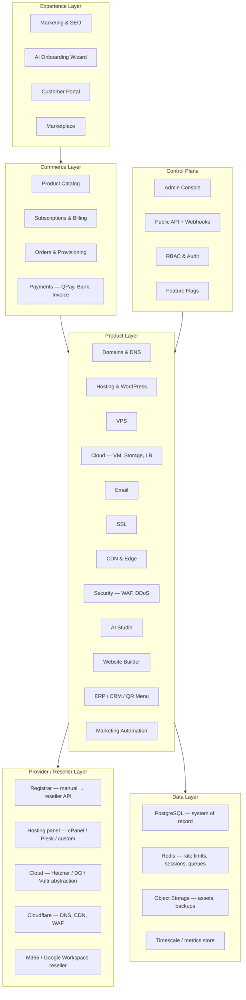
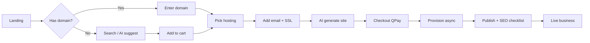
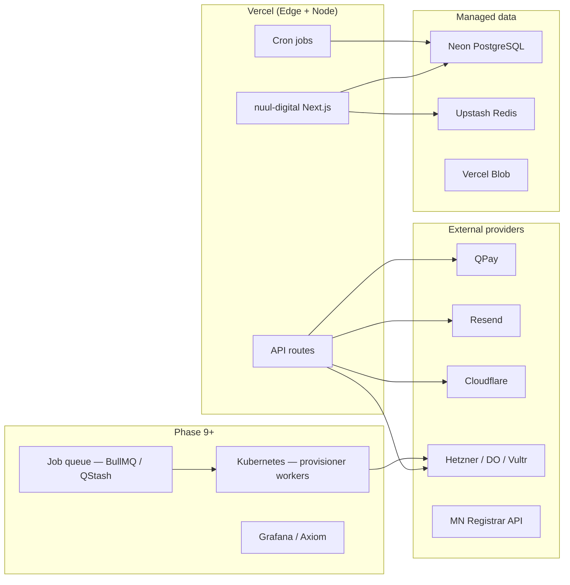
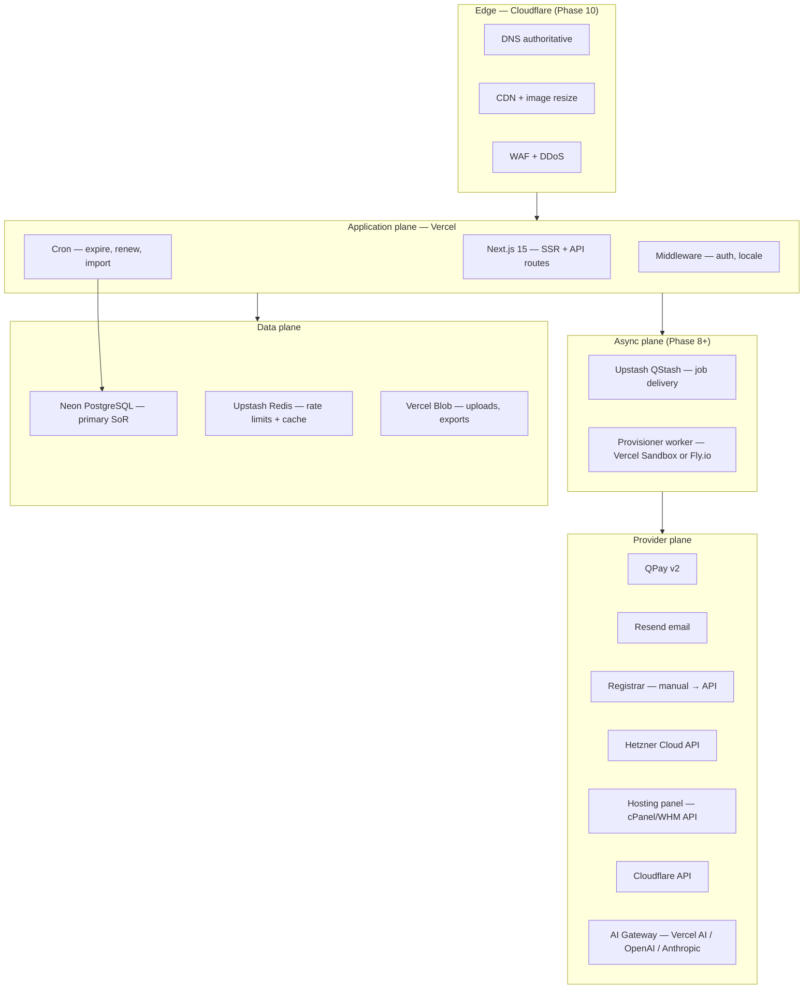
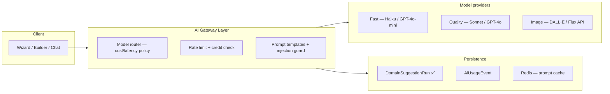
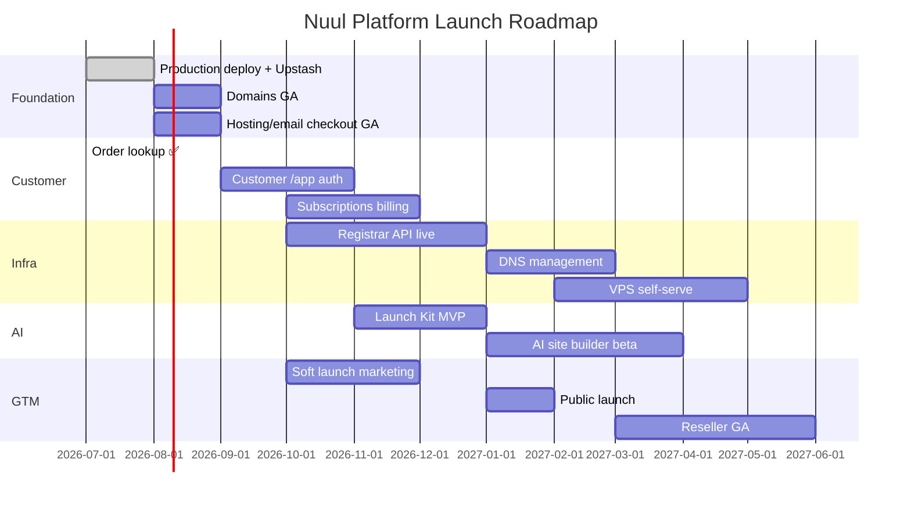

# Nuul Digital — Digital Infrastructure Platform (Master Design)

| Field | Value |
|---|---|
| **Version** | 1.1 |
| **Date** | July 7, 2026 |
| **Status** | Strategic blueprint |
| **Codebase** | `nuul-digital` (Next.js 15, Prisma, PostgreSQL) |
| **Production** | https://nuul.digital |
| **Companion** | [DOMAINS-MODULE-DESIGN.md](./DOMAINS-MODULE-DESIGN.md) (Phase 1–6 implementation detail) |

---

## Executive Summary

**North star:** Mongolia's leading **Digital Infrastructure Platform** — one place to launch a complete online business in minutes, not months.

**Positioning:** Not a web agency storefront. A **subscription infrastructure company** combining domain registrar UX, managed hosting, cloud primitives, AI generation, and business tools — comparable in ambition to Cloudflare + Hostinger + Shopify + Vercel, localized for Mongolia first.

**What exists today (July 2026):**

| Capability | Status |
|---|---|
| Domain search (RDAP), checkout, QPay, bank transfer | ✅ Live (flag-gated) |
| Admin domain/service order queues | ✅ |
| Hosting & business-email landing + live checkout | ✅ (flag-gated) |
| Order lookup portal (magic link) | ✅ |
| AI domain suggestions (scaffold) | ✅ |
| OnboardingJourney spine | ✅ |
| Upstash rate limiting | ⚠️ GA blocker — pending |
| VPS / Cloud / Builder / ERP / Marketplace | 📋 This document |

**Strategic principle:** Every product is a **subscription attach** to a core identity graph: `Organization → Domain → Site → Services`.

---

# 1. Product Architecture

## 1.1 Layered platform model



## 1.2 Product domains (catalog)

Each product is a **SKU family** with plans, addons, and provisioning hooks.

| Domain | SKUs | Provisioning | Phase |
|---|---|---|---|
| **Domains** | Search, register, transfer, renew, premium, bulk | Registrar provider | 1 ✅ → 6 |
| **DNS** | Zones, records, templates | Cloudflare API | 7 |
| **Hosting** | Shared, WP, Woo, Laravel, Node, Python, PHP, Business | Panel API + manual | 2 ✅ → 5 |
| **VPS** | 1–32 vCPU tiers, OS images | Cloud API | 8 |
| **Cloud** | VM, object/block storage, snapshots, LB, firewall | Cloud API | 9 |
| **Email** | Business mailboxes, webmail; M365/GWS bundles | Mail provider | 5 ✅ → 10 |
| **SSL** | Free LE, Premium, Wildcard, EV | ACME / reseller | 2 scaffold → 7 |
| **CDN** | Global CDN, image opt, cache rules | Cloudflare | 10 |
| **Security** | DDoS, malware scan, WAF | Cloudflare + agents | 11 |
| **AI Studio** | Name, site, logo, copy, SEO, chatbot, assistant | LLM gateway | 3 partial → 12 |
| **Website** | Builder, templates, CMS, vertical packs | Internal + headless | 13 |
| **ERP** | Inventory, accounting, CRM, POS, HR | Modular micro-apps | 14 |
| **Marketing** | SEO, ads connectors, email, funnels | Integrations | 15 |
| **Marketplace** | Themes, plugins, AI agents, workflows | Third-party SDK | 16 |

## 1.3 Core platform primitives

Reusable across all products:

1. **Organization** — billing entity (individual or company)
2. **Project / Site** — one digital presence (domain + hosting + builder instance)
3. **Subscription** — recurring entitlement to a plan SKU
4. **ServiceInstance** — provisioned resource (hosting account, VPS, mailbox)
5. **Order** — transactional purchase (domain years, setup fees)
6. **Invoice & Payment** — unified billing ledger
7. **OnboardingJourney** — cross-sell state machine (already in schema)
8. **AIRecommendation** — contextual upsell engine

## 1.4 AI-first recommendation engine

```
Input: business intent ("Coffee Shop", "Барилгын компани")
  ↓
Context: locale, budget signals, journey step, owned assets
  ↓
Output bundle:
  - Domain candidates (availability-checked)
  - Brand kit (colors, logo concepts)
  - Template + hosting tier
  - Email plan
  - SSL (included)
  - SEO keyword pack
  - GMB + Facebook checklist
  - QR menu tier
  - Chatbot script
  - Marketing starter plan
  ↓
One-click "Launch Kit" checkout (ServiceBundle)
```

**Implementation path:** Extend `DomainSuggestionRun` + `ServiceBundle` → `LaunchKitRecommendation` (JSON) with priced cart prefill.

## 1.5 Reseller & white-label

| Model | Audience | Mechanics |
|---|---|---|
| **Retail** | End customers | nuul.digital branded, list price |
| **Reseller** | Agencies, IT shops | Wholesale pricing, margin control, sub-accounts |
| **Partner** | Referral affiliates | Commission on first payment + renewals |
| **White-label** | Enterprise | Custom domain, logo, isolated admin slice |

**Provider abstraction pattern** (already started in `src/lib/domains/registrar/`):

```
ProviderInterface → ManualProvider | ResellerStub | HetznerProvider | ...
```

Same pattern for: `HostingProvider`, `VpsProvider`, `EmailProvider`, `SslProvider`.

---

# 2. Database Design

## 2.1 Current foundation (keep)

Already production-ready spine:

- `User`, `Account`, `Session` — auth
- `DomainOrder`, `ServiceOrder`, `Payment` — commerce
- `TldProduct`, `DomainSearch`, `DomainSuggestionRun`
- `OnboardingJourney`, `ServiceBundle`
- `SiteSetting` — feature flags
- `ActivityLog`, `Lead`, `ProjectBrief`

## 2.2 Phase 7+ schema extensions

### Organization & multi-tenancy

```prisma
model Organization {
  id            String   @id @default(cuid())
  slug          String   @unique
  name          String
  type          OrgType  // INDIVIDUAL | BUSINESS | RESELLER | PARTNER
  billingEmail  String
  taxId         String?
  ownerId       String
  owner         User     @relation(fields: [ownerId], references: [id])
  members       OrgMember[]
  projects      Project_site[]
  subscriptions Subscription[]
  invoices      Invoice[]
  resellerProfile ResellerProfile?
  createdAt     DateTime @default(now())
}

model OrgMember {
  id        String   @id @default(cuid())
  orgId     String
  userId    String
  role      OrgRole  // OWNER | ADMIN | BILLING | TECH | VIEWER
  org       Organization @relation(...)
  user      User     @relation(...)
  @@unique([orgId, userId])
}
```

### Unified product catalog

```prisma
model ProductFamily {
  id       String @id  // domains | hosting | vps | cloud | email | ssl | ai | builder
  slug     String @unique
  nameMn   String
  nameEn   String
  plans    ProductPlan[]
}

model ProductPlan {
  id            String @id @default(cuid())
  familyId      String
  key           String  // starter | pro | business | vps-2cpu
  nameMn        String
  nameEn        String
  billingPeriod BillingPeriod // MONTHLY | YEARLY | ONE_TIME | USAGE
  priceMnt      Int
  setupFeeMnt   Int     @default(0)
  specs         Json    // cpu, ram, storage, mailboxes, etc.
  providerSku   String? // upstream mapping
  active        Boolean @default(true)
  @@unique([familyId, key])
}
```

### Subscriptions & billing

```prisma
model Subscription {
  id              String   @id @default(cuid())
  orgId           String
  planId          String
  status          SubStatus // ACTIVE | PAST_DUE | CANCELLED | TRIALING
  currentPeriodStart DateTime
  currentPeriodEnd   DateTime
  cancelAtPeriodEnd  Boolean @default(false)
  serviceInstanceId  String?
  metadata        Json?
}

model Invoice {
  id          String @id @default(cuid())
  orgId       String
  number      String @unique
  status      InvoiceStatus
  subtotalMnt Int
  taxMnt      Int    @default(0)
  totalMnt    Int
  dueAt       DateTime
  paidAt      DateTime?
  lineItems   InvoiceLineItem[]
  payments    Payment[]  // extend Payment with invoiceId
}

model CreditWallet {
  orgId     String @id
  balanceMnt Int   @default(0)
  ledger    CreditLedgerEntry[]
}
```

### Infrastructure resources

```prisma
model ServiceInstance {
  id           String @id @default(cuid())
  orgId        String
  projectId    String?
  type         ServiceType // extend enum: VPS | CLOUD_VM | HOSTING | EMAIL | SSL | BUILDER_SITE
  planKey      String
  externalId   String?     // provider resource id
  status       ProvisionStatus
  region       String?
  primaryDomain String?
  credentials  Json?       // encrypted at app layer
  specs        Json?
  provisionedAt DateTime?
}

model DnsZone {
  id         String @id
  orgId      String
  domainName String @unique
  provider   String // cloudflare | manual
  externalId String?
  records    DnsRecord[]
}

model WebsiteSite {
  id           String @id
  orgId        String
  projectId    String
  templateKey  String?
  builderVersion Int   @default(1)
  publishUrl   String?
  status       SiteStatus // DRAFT | PUBLISHED | SUSPENDED
  aiGenerated  Boolean @default(false)
}
```

### Marketplace

```prisma
model MarketplaceListing {
  id          String @id
  vendorOrgId String
  type        ListingType // THEME | PLUGIN | TEMPLATE | AI_AGENT | WORKFLOW
  slug        String @unique
  priceMnt    Int
  revenueShareBps Int  // basis points to platform
  status      ListingStatus
  installs    MarketplaceInstall[]
}
```

### AI usage metering

```prisma
model AiUsageEvent {
  id        String @id
  orgId     String?
  feature   String // domain_suggest | site_gen | logo_gen | chatbot
  model     String
  tokensIn  Int
  tokensOut Int
  costMnt   Int?
  createdAt DateTime @default(now())
  @@index([orgId, createdAt])
}
```

## 2.3 Migration strategy

1. **Backfill `Organization`** from unique `customerEmail` on orders
2. Link existing `DomainOrder` / `ServiceOrder` → `orgId` + `projectId`
3. Introduce `Subscription` alongside one-time `ServiceOrder` (hosting monthly)
4. Keep polymorphic `Payment`; add `invoiceId` nullable FK
5. No big-bang — each phase adds tables behind feature flags

---

# 3. Information Architecture

## 3.1 Public marketing (acquisition)

```
/                     — Platform hero: "Launch your business in minutes"
/pricing              — Unified pricing matrix
/solutions            — By vertical (Restaurant, Hotel, Construction, …)
/solutions/[vertical]
/compare              — vs GoDaddy, Hostinger, local registrars
/developers           — API docs, SDK, webhooks
/partners             — Reseller, affiliate, white-label
/marketplace          — Themes, plugins, AI agents
```

## 3.2 Product hubs (catalog)

```
/domains              — Search, transfer, bulk ✅
/domains/transfer
/domains/pricing
/hosting              — Shared plans ✅
/hosting/wordpress
/hosting/woocommerce
/hosting/nodejs
/vps
/cloud
/email                — Business email ✅
/ssl
/cdn
/security
/ai                   — AI studio hub
/website              — Builder landing
/erp
/marketing
```

## 3.3 Authenticated customer portal (`/app`)

```
/app                      — Dashboard overview
/app/projects             — Sites / businesses
/app/projects/[id]        — Project control center
/app/domains
/app/hosting
/app/email
/app/vps
/app/cloud
/app/websites
/app/ai
/app/billing
/app/invoices
/app/subscriptions
/app/support
/app/settings
```

## 3.4 Admin (`/admin`) — extend current

```
/admin                    — KPI dashboard
/admin/orders             — All orders (unified)
/admin/domains            — ✅
/admin/services           — ✅ hosting/email
/admin/hosting
/admin/vps
/admin/cloud
/admin/users
/admin/organizations
/admin/billing
/admin/invoices
/admin/support/tickets
/admin/resellers
/admin/partners
/admin/marketplace
/admin/ai-usage
/admin/settings
/admin/logs
/admin/monitoring
```

---

# 4. UX Wireframes (key screens)

## 4.1 Platform homepage

```
┌─────────────────────────────────────────────────────────────┐
│  [Logo]  Products ▾  Solutions  Pricing  Docs    [Login][Start] │
├─────────────────────────────────────────────────────────────┤
│                                                             │
│     Launch your Mongolian business online in minutes        │
│                                                             │
│     ┌──────────────────────────────────────┐ [Search]      │
│     │ mycoffee.mn                          │               │
│     └──────────────────────────────────────┘               │
│                                                             │
│     Or describe your business:                              │
│     ┌──────────────────────────────────────┐ [✨ AI Launch] │
│     │ Coffee shop in Sukhbaatar...         │               │
│     └──────────────────────────────────────┘               │
│                                                             │
│  ┌─────────┐ ┌─────────┐ ┌─────────┐ ┌─────────┐          │
│  │ Domain  │ │ Hosting │ │  Email  │ │   AI    │          │
│  └─────────┘ └─────────┘ └─────────┘ └─────────┘          │
└─────────────────────────────────────────────────────────────┘
```

## 4.2 AI Launch Wizard (3-step)

```
Step 1: Business        Step 2: AI Bundle         Step 3: Checkout
─────────────────       ─────────────────         ───────────────
Name: [Coffee Lab]      ☑ mycoffeelab.mn  ₮49k    Total: ₮189k/mo
Type: [Restaurant ▾]    ☑ Starter Hosting       [QPay] [Bank]
City: [Ulaanbaatar]     ☑ Basic Email x3
                        ☑ Free SSL
                        ☑ Restaurant template
                        ☑ QR Menu Lite
                        [Customize] [Launch →]
```

## 4.3 Customer project dashboard

```
Project: Coffee Lab                    [Publish] [Support]
────────────────────────────────────────────────────────
┌──────────────┐ ┌──────────────┐ ┌──────────────┐
│ Domain       │ │ Hosting      │ │ Email        │
│ mycoffeelab  │ │ Pro · Active │ │ 3/5 boxes    │
│ Exp: 2027-07 │ │ 78% disk     │ │              │
└──────────────┘ └──────────────┘ └──────────────┘
┌──────────────┐ ┌──────────────┐ ┌──────────────┐
│ Website      │ │ SSL          │ │ Analytics    │
│ Draft        │ │ Active       │ │ 1.2k visits  │
└──────────────┘ └──────────────┘ └──────────────┘
Quick actions: [Edit site] [Add mailbox] [SEO scan] [AI chatbot]
```

## 4.4 Admin unified order queue

```
Filters: [All types ▾] [Pending ▾] [Today ▾]     Search: _______
────────────────────────────────────────────────────────────────
#ND-2026-0842  DOMAIN   example.mn      PAID        Fulfilling  [Open]
#NS-2026-0156  HOSTING  Pro/mo          PENDING     —           [Open]
#NS-2026-0157  EMAIL    Team/5box       COMPLETED   —           [View]
```

**Design system:** Extend existing dark premium tokens (`design-tokens.ts`). Light mode via `next-themes`. Motion: Framer micro-interactions on checkout sheets (already implemented). Density: Linear-inspired tables in admin.

---

# 5. Complete Sitemap

## Public (MN default, `/en` mirror)

| Path | Purpose |
|---|---|
| `/` | Platform home |
| `/pricing` | All products pricing |
| `/domains` | Domain search ✅ |
| `/domains/transfer` | Transfer in |
| `/domains/bulk` | Bulk search |
| `/hosting` | Shared hosting ✅ |
| `/hosting/wordpress` | WP hosting |
| `/hosting/nodejs` | Node hosting |
| `/vps` | VPS plans |
| `/cloud` | Cloud products |
| `/business-email` | Email ✅ |
| `/ssl` | SSL ✅ |
| `/cdn` | CDN |
| `/security` | Security suite |
| `/ai` | AI studio |
| `/website` | Builder |
| `/website/templates` | Template gallery |
| `/erp` | ERP suite |
| `/marketing` | Marketing tools |
| `/marketplace` | Extensions store |
| `/orders/lookup` | Guest order portal ✅ |
| `/legal/*` | Terms, privacy, domain policy ✅ |
| `/quote` | Custom project brief |
| `/contact` | Sales |
| `/partners` | Partner program |
| `/developers` | API docs |

## App (authenticated)

| Path | Purpose |
|---|---|
| `/app` | Dashboard |
| `/app/onboarding` | Post-signup wizard |
| `/app/projects` | All projects |
| `/app/projects/[id]/*` | Per-product management |
| `/app/billing` | Payment methods, invoices |
| `/app/support` | Tickets |

## API (versioned)

| Prefix | Purpose |
|---|---|
| `/api/v1/domains/*` | Domain operations |
| `/api/v1/hosting/*` | Hosting lifecycle |
| `/api/v1/billing/*` | Subscriptions, invoices |
| `/api/v1/ai/*` | AI generation |
| `/api/webhooks/*` | Inbound provider events |

---

# 6. User Flows

## 6.1 Primary: "Zero to Launch" (target: <10 minutes)



## 6.2 Domain-only (current Phase 1 flow) ✅

Search → Checkout sheet → QPay/Bank → Email receipt → Admin fulfill → Customer lookup portal

## 6.3 Subscription lifecycle

```
Trial (14d) → Active → Renewal invoice → Paid → Extended
                  ↓ past due (7d grace)
              Suspended → Cancelled → Data retention (30d) → Deleted
```

## 6.4 Reseller flow

```
Apply → Approved → Wholesale catalog → Create customer org → Markup price
  → Customer pays retail → Commission to reseller → Platform keeps margin
```

---

# 7. Pricing Strategy

## 7.1 Principles

1. **Anchor on domain** — low-friction entry, high-LTV attach
2. **Bundle discount** — "Launch Kit" 15–25% vs à la carte
3. **MNT-first** — round numbers (₮9,900 / ₮19,900 / ₮49,900)
4. **Yearly incentive** — 2 months free on annual hosting/email
5. **Usage overlay** — AI credits, storage overage, bandwidth tiers

## 7.2 Starter price matrix (MNT/month, indicative)

| Product | Starter | Pro | Business |
|---|---|---|---|
| **Domain .mn** | ₮49,000/yr | — | — |
| **Hosting** | ₮9,900 | ₮19,900 | ₮49,900 |
| **Email** | ₮4,900 | ₮14,900 | ₮39,900 |
| **VPS** | ₮29,900 (1 vCPU) | ₮59,900 | ₮129,900 |
| **SSL** | Free (LE) | ₮99,000/yr WV | Custom EV |
| **AI credits** | 100 incl. | 500 | 2000 |
| **Builder** | Free w/ hosting | ₮9,900 | ₮29,900 |

## 7.3 Launch Kits (bundles)

| Kit | Includes | Price |
|---|---|---|
| **Solo** | .mn + Starter hosting + 1 email + SSL + AI site | ₮69,000/yr + ₮9,900/mo |
| **Business** | .mn + Pro hosting + 5 email + SSL + Builder Pro | ₮69,000/yr + ₮34,900/mo |
| **Restaurant** | Above + QR Menu + GMB setup guide + chatbot | Custom |

## 7.4 Reseller wholesale

- 20–40% below retail on infra products
- Volume tiers at 50 / 200 / 1000 active subscriptions
- White-label: +₮500,000/mo platform fee

---

# 8. Subscription System

## 8.1 Billing engine requirements

| Capability | Implementation |
|---|---|
| Recurring cycles | Monthly / yearly per `Subscription` |
| Proration | Upgrade mid-cycle (daily prorate) |
| Dunning | 3 retry emails + QPay re-invoice |
| Credits | `CreditWallet` for AI usage |
| Coupons | `Coupon` + `Promotion` tables |
| Tax | VAT-ready line items (10% MN) |
| Invoicing | PDF + email via Resend |

## 8.2 Payment methods (Mongolia-first)

1. **QPay** — primary (existing integration ✅)
2. **Bank transfer** — fallback (existing ✅)
3. **Invoice NET-14** — enterprise orgs
4. **SocialPay** — Phase 2 payment rail
5. **Stripe** — global expansion phase

## 8.3 Renewal cron jobs

| Job | Schedule | Action |
|---|---|---|
| `expire-payments` | Hourly ✅ | Cancel unpaid orders |
| `renewal-invoices` | Daily | Generate upcoming renewal invoices |
| `dunning` | Daily | Past-due reminders |
| `suspend-services` | Daily | Suspend overdue subscriptions |
| `domain-expiry` | Daily | 30/14/7 day warnings |

## 8.4 Affiliate & reseller commissions

```
CommissionEvent {
  partnerId, orderId, type: REFERRAL | RESELLER_MARGIN,
  amountMnt, status: PENDING | PAID, paidAt
}
```

---

# 9. Admin Dashboard Design

## 9.1 KPI dashboard (home)

| Widget | Metric |
|---|---|
| MRR / ARR | Subscription revenue |
| New orders (24h) | Domain + service + VPS |
| Pending fulfillment | Queue depth |
| Churn (30d) | Cancelled subs |
| AI usage cost | Token spend vs revenue |
| Support SLA | Open tickets > 24h |
| Provider health | Registrar, hosting API status |

## 9.2 Operational modules

Extend existing admin shell (`admin-shell.tsx`):

- **Unified inbox** — orders, tickets, failed provisions
- **Fulfillment drawers** — domain register, hosting create, mailbox setup
- **Provider console** — manual override when API fails
- **Feature flags UI** — replace raw `SiteSetting` keys
- **Audit trail** — `ActivityLog` with resource links

## 9.3 RBAC expansion

```
platform:admin
domains:*
hosting:*
cloud:*
billing:*
support:*
reseller:manage
ai:usage:view
```

---

# 10. Customer Dashboard Design

## 10.1 Phases

| Phase | Experience |
|---|---|
| **Now** | `/orders/lookup` magic link ✅ |
| **Phase A** | `/app` with email/password or magic link |
| **Phase B** | Full project dashboard |
| **Phase C** | Mobile app (PWA first) |

## 10.2 Dashboard sections

1. **Overview** — health cards, quick actions, journey progress
2. **Domains & DNS** — list, renew, DNS editor (Phase 7)
3. **Hosting** — file manager link, PHP version, backups
4. **Email** — mailbox admin (forwarders, aliases)
5. **Website** — builder embed, publish, preview
6. **AI Studio** — generate, history, credit balance
7. **Billing** — subscriptions, invoices, payment methods
8. **Support** — tickets, knowledge base

## 10.3 Onboarding checklist (gamified)

```
☑ Domain registered
☑ Hosting active
☐ Email configured
☐ SSL active
☐ Website published
☐ Google Business claimed
☐ Analytics connected
Progress: 37% — [Continue setup →]
```

---

# 11. API Design

## 11.1 Principles

- **REST first** — `/api/v1/*`, JSON, Zod validation (match existing patterns)
- **GraphQL** — customer portal aggregation layer (Phase B) via `/api/graphql`
- **Webhooks outbound** — `order.created`, `subscription.renewed`, `site.published`
- **Webhooks inbound** — QPay ✅, registrar, hosting panel, Cloudflare
- **Idempotency** — `Idempotency-Key` header on POST
- **Rate limits** — Upstash per-IP + per-API-key

## 11.2 Core endpoints (v1)

### Domains
```
POST   /api/v1/domains/search
POST   /api/v1/domains/suggest
POST   /api/v1/domains/orders
GET    /api/v1/domains/orders/:id
POST   /api/v1/domains/:name/transfer
GET    /api/v1/domains/:name/whois
```

### DNS
```
GET/POST/DELETE /api/v1/dns/zones/:domain/records
```

### Hosting & VPS
```
GET    /api/v1/hosting/plans
POST   /api/v1/hosting/instances
POST   /api/v1/vps/instances
POST   /api/v1/vps/instances/:id/actions  # reboot, snapshot
```

### Billing
```
GET    /api/v1/billing/subscriptions
POST   /api/v1/billing/subscriptions
POST   /api/v1/billing/invoices/:id/pay
GET    /api/v1/billing/credits
```

### AI
```
POST   /api/v1/ai/launch-kit
POST   /api/v1/ai/website/generate
POST   /api/v1/ai/logo/generate
POST   /api/v1/ai/chatbot/configure
```

### Auth
```
POST   /api/v1/auth/magic-link      # extend order lookup pattern
GET    /api/v1/auth/session
```

## 11.3 API keys (developers)

```prisma
model ApiKey {
  id        String @id
  orgId     String
  name      String
  keyHash   String
  scopes    String[]
  lastUsedAt DateTime?
}
```

---

# 12. Infrastructure Design

## 12.1 Deployment topology (current → target)



## 12.2 Service boundaries (microservice-ready)

| Service | Responsibility | Now | Future |
|---|---|---|---|
| **web** | Marketing + app UI | Monolith ✅ | Monolith |
| **api-gateway** | Auth, rate limit, routing | In monolith | Optional split |
| **billing-svc** | Subscriptions, invoices | In monolith | Split at 10k MRR |
| **provisioner** | Async provider calls | Cron + inline | Worker + queue |
| **ai-svc** | LLM orchestration | `/api/chat` | Dedicated with metering |
| **builder-svc** | Site generation + hosting | — | Phase 13 |

## 12.3 Async provisioning pipeline

```
Order PAID → Event: order.paid → Queue → Provisioner worker
  → Provider API call → Poll status → Update ServiceInstance
  → Email customer → Webhook notify
```

Use **QStash** or **BullMQ + Redis** when inline cron proves insufficient.

## 12.4 Security & compliance

| Layer | Control |
|---|---|
| Edge | Cloudflare WAF, DDoS, bot fight |
| App | CSP, CSRF, RBAC, Zod validation ✅ |
| Data | Encrypt provider credentials at rest |
| Audit | ActivityLog + immutable event stream |
| Secrets | Vercel env + rotation playbook |
| MN compliance | Domain registrant data per `.mn` policy ✅ |

## 12.5 Observability

- **Health:** `/api/health/rate-limit`, `/api/health/domains` ✅
- **SLOs:** Search p95 < 800ms, checkout error < 0.5%, provision < 15min
- **Alerts:** Provider API down, payment callback failures, queue depth

---

# Implementation Roadmap (aligned to codebase)

| Phase | Quarter | Deliverable | Builds on |
|---|---|---|---|
| **1–5** | Q2 2026 | Domains, hosting/email checkout, lookup | ✅ Shipped |
| **6** | Q3 2026 | Registrar auto-register, DNS prep | In progress |
| **7** | Q3 2026 | Customer `/app` auth, org model, subscriptions | New |
| **8** | Q4 2026 | VPS catalog + Hetzner provisioner | Provider abstraction |
| **9** | Q4 2026 | Cloud storage, snapshots | Cloud API |
| **10** | Q1 2027 | Cloudflare DNS + CDN integration | |
| **11** | Q1 2027 | AI Launch Kit + builder MVP | AI + ServiceBundle |
| **12** | Q2 2027 | Marketplace + reseller portal | |
| **13** | Q2 2027 | ERP Lite (CRM + invoicing) | |
| **14** | Q3 2027 | Global expansion (Stripe, EN-first) | |

---

# Success Metrics

| Metric | Year 1 target |
|---|---|
| Paid domains | 2,000 |
| Hosting subscriptions | 800 |
| MRR | ₮80M+ |
| Attach rate (domain → hosting) | > 45% |
| AI Launch Kit conversion | > 12% |
| NPS | > 50 |
| Support first response | < 2h |

---

# Immediate next actions (post-deploy)

1. ✅ Complete Upstash Redis on Vercel (GA blocker)
2. Enable `domains_module_enabled` + `domains_service_orders_enabled` in production
3. Phase 7 kickoff: `Organization` model + `/app` auth shell
4. Unified admin order inbox (domain + service → all types)
5. Launch Kit MVP: AI input → `ServiceBundle` cart

---

# 13. Cloud Architecture

## 13.1 Design principles

1. **Monolith-first, extract on pain** — stay on Vercel + Neon until billing or provisioning throughput forces a split (est. >₮150M MRR or >500 provisions/day).
2. **Provider abstraction everywhere** — never couple business logic to Hetzner, Cloudflare, or a single registrar; use interfaces already started in `src/lib/domains/registrar/`.
3. **Async by default for provisioning** — anything >3s (VPS create, DNS propagate, AI site gen) goes through a queue; HTTP returns `202 Accepted` + job ID.
4. **Region realism for Mongolia** — primary compute: `iad1` (Vercel) + DB: `us-east-1` (Neon); customer-facing infra: EU (Hetzner Falkenstein/Helsinki) or Singapore for APAC latency; do not promise `<50ms` in Ulaanbaatar until a local POP exists.
5. **Cost visibility** — every `ServiceInstance` stores `providerCostMnt` vs `retailPriceMnt` for margin dashboards.

## 13.2 Production topology (2026–2027)



## 13.3 Environment strategy

| Environment | Purpose | Data | Providers |
|---|---|---|---|
| **Local** | Dev | SQLite optional / local PG | Stubs, QPay sandbox |
| **Preview** | PR branches | Neon branch DB | Sandbox credentials |
| **Staging** | Pre-prod QA | Neon staging | Sandbox + 1 real registrar test domain |
| **Production** | Live | Neon main | Production keys only |

**Rule:** Preview and production share no database. Feature flags in `SiteSetting` gate risky modules per environment.

## 13.4 Compute split decision tree

| Workload | Runtime | Rationale |
|---|---|---|
| Marketing pages, search UI | Vercel SSR/SSG | Already deployed ✅ |
| Checkout, QPay, webhooks | Vercel Node `runtime = nodejs` | Long-lived secrets ✅ |
| RDAP domain checks | Vercel Node + Redis cache | IO-bound, cacheable ✅ |
| VPS provision (create VM) | QStash → worker | 30–120s provider latency |
| AI website generation | QStash → worker | 60–180s, token-heavy |
| Backup jobs | Cron + worker | Off-peak, large payloads |
| Future: packet capture / agents | Dedicated VPS (not serverless) | Persistent processes |

## 13.5 Storage architecture

| Tier | Technology | Use case | Lifecycle |
|---|---|---|---|
| **Hot** | Neon PG | Orders, users, config | Permanent |
| **Warm** | Upstash Redis | RDAP cache (15m), rate limits, session | TTL |
| **Object** | Vercel Blob / R2 (Phase 9) | Site assets, backups, invoice PDFs | Versioned |
| **Cold** | R2 / S3 Glacier (Phase 11) | Compliance archives, logs >90d | Cheap retention |

**Backup policy (production-ready Day 1):**
- Neon: enable point-in-time recovery (7d minimum)
- Daily logical export to Blob (encrypted)
- Provider snapshots for VPS (retain 7 daily, 4 weekly)

## 13.6 Networking & DNS

Phase 1–6: Nuul hosts marketing on Vercel; customer sites on reseller hosting (separate A records).

Phase 10+: Cloudflare as DNS authority for domains sold through Nuul:
- Automated zone creation on `DomainOrder.COMPLETED`
- Template records: `@` → hosting IP, `www` CNAME, MX for email
- SSL: Universal SSL at edge + origin LE on hosting

## 13.7 Scalability targets

| Signal | Threshold | Action |
|---|---|---|
| API p95 > 1.5s | 7 days | Profile RDAP cache, DB indexes |
| DB connections saturated | >80% pool | Neon compute upgrade + Prisma connection limit |
| Provision queue depth | >50 jobs | Add worker instance |
| MRR > ₮150M | — | Extract billing microservice |
| Multi-region demand | CN/APAC customers | Singapore Hetzner + CF geo routing |

## 13.8 Cost model (indicative monthly at launch scale)

| Item | ~500 customers | Notes |
|---|---|---|
| Vercel Pro | $20–150 | Bandwidth-driven |
| Neon Scale | $19–69 | Storage + compute |
| Upstash Redis | $0–30 | Free tier → pay per request |
| Resend | $20 | Transactional volume |
| Cloudflare Pro | $20/zone batch | Phase 10 |
| Hetzner VPS (wholesale) | €200–800 | Pass-through + margin |
| LLM API | $50–300 | Metered to customers |

**Target gross margin:** Domains 15–25%, hosting 40–55%, VPS 30–45%, AI credits 50%+.

---

# 14. Security Model

## 14.1 Threat model (STRIDE summary)

| Threat | Asset | Mitigation (implemented / planned) |
|---|---|---|
| **Spoofing** | Admin, customer accounts | NextAuth credentials + magic-link TTL ✅; MFA Phase 7 |
| **Tampering** | Orders, payments | Zod validation ✅, Prisma transactions, idempotent webhooks |
| **Repudiation** | Admin actions | `ActivityLog` ✅; signed audit export Phase 8 |
| **Information disclosure** | PII, registrant data | RBAC ✅, encrypt `ServiceInstance.credentials`, no secrets in client |
| **Denial of service** | Search, checkout APIs | Upstash rate limits (GA blocker), CF WAF Phase 10 |
| **Elevation of privilege** | Admin routes | Middleware + layout RBAC ✅, per-route permission checks |

## 14.2 Defense in depth

```
Layer 1: Cloudflare — DDoS, bot score, geo block (optional)
Layer 2: Vercel Firewall — path rate limits (DOMAINS-DEPLOY.md templates)
Layer 3: Middleware — /admin auth gate
Layer 4: API guards — guardMutation() CSRF + rate limit ✅
Layer 5: Module guards — requireDomainsModule(), requireServiceOrdersEnabled() ✅
Layer 6: RBAC — src/lib/rbac.ts permission matrix
Layer 7: Data — row-level org scoping (Phase 7)
Layer 8: Secrets — Vercel encrypted env, SiteSetting write-only tokens
```

## 14.3 Identity & access

| Actor | Auth method | Session | Permissions |
|---|---|---|---|
| **Public customer** | Guest checkout, magic link | `nuul_order_lookup` cookie (7d) ✅ | Own orders by email |
| **Registered customer** | Email/password or magic link | NextAuth JWT | Org-scoped RBAC |
| **Admin staff** | Credentials + MFA (required) | NextAuth | `domains:*`, `hosting:*`, etc. |
| **Reseller** | Separate portal login | NextAuth + `org.type=RESELLER` | Sub-orgs only |
| **API consumer** | API key + HMAC webhook sig | Key per org | Scoped scopes array |
| **Cron / workers** | `Authorization: Bearer CRON_SECRET` ✅ | None | Internal routes only |

**Production requirements:**
- `ORDER_LOOKUP_SECRET` or `AUTH_SECRET` in production ✅
- Admin MFA enforced before reseller launch
- Password policy: 12+ chars, breach check (Have I Been Pwned API)

## 14.4 Payment security

- QPay callbacks: verify signature, idempotent `Payment` update ✅
- No card data stored (QPay handles PCI)
- Bank transfer: reference code = `orderNumber` only; never expose full bank creds client-side
- Refunds: admin-only action + `ActivityLog` + dual approval >₮500k

## 14.5 Data classification & retention

| Class | Examples | Storage | Retention |
|---|---|---|---|
| **Public** | TLD prices, plans | PG + cache | Indefinite |
| **Internal** | Margins, provider SKUs | PG admin-only | Indefinite |
| **Confidential** | Customer PII, registrant ID | PG encrypted columns | Life of account + 3y |
| **Restricted** | API keys, registrar creds | Env + encrypted JSON | Rotate 90d |

**MN domain policy:** Registrant ID fields on `DomainOrder` — access logged, export restricted to `domains:fulfill` role.

## 14.6 Vulnerability management

| Activity | Cadence |
|---|---|
| `npm audit` in CI | Every PR |
| Dependency updates | Monthly patch window |
| Penetration test | Annual (before reseller GA) |
| Security headers audit | `next.config.mjs` CSP/HSTS ✅ review quarterly |
| Incident response | 4h ack, 24h customer comms for breaches |

## 14.7 Compliance roadmap

| Standard | Priority | Timeline |
|---|---|---|
| MN Personal Data Protection | High | Privacy policy + DPA templates Q3 2026 |
| PCI DSS | N/A | Outsourced to QPay |
| SOC 2 Type I | Medium | Year 3 (enterprise sales) |
| ISO 27001 | Low | Year 4+ |

---

# 15. AI Architecture

## 15.1 AI product map

| Feature | Input | Output | Status | Monetization |
|---|---|---|---|---|
| **Domain suggest** | Business description | 8–12 labels + RDAP check | ✅ Scaffold | Free (acquisition) |
| **Launch Kit** | Business type + name | Priced bundle cart | Phase 11 | Bundle uplift |
| **Website generator** | Brand + pages | Static site JSON → publish | Phase 11 | Hosting attach |
| **Logo generator** | Name + style | PNG/SVG assets | Phase 12 | Credits |
| **Copywriter** | Page + tone | MN/EN copy blocks | Phase 12 | Credits |
| **SEO assistant** | URL + keywords | Meta, schema, checklist | Phase 12 | Pro plan incl. |
| **Chatbot builder** | FAQ + docs | Widget + `/api/chat` ext. | Partial ✅ | Subscription |
| **Business assistant** | Org context | Recommendations, tasks | Phase 13 | Pro+ incl. |

## 15.2 Technical architecture



**Existing code to extend:**
- `src/lib/domains/suggest-ai.ts` — structured JSON output, rule fallback ✅
- `src/app/api/chat/route.ts` — visitor chatbot
- `src/app/api/domains/suggest/route.ts` — feature-flagged endpoint

## 15.3 Model routing policy (production-ready)

| Task | Primary model | Fallback | Max tokens | Timeout |
|---|---|---|---|---|
| Domain labels | Claude Haiku / GPT-4o-mini | Rule-based `suggestions.ts` ✅ | 800 | 8s |
| Launch Kit plan | Claude Sonnet | Template JSON | 2,000 | 15s |
| Full page copy | GPT-4o-mini | Cached templates | 1,500 | 12s |
| Site structure | Sonnet | — | 4,000 | 30s (async) |
| Logo | Image API | Placeholder SVG | — | 60s (async) |

**Rule:** Always have a **non-AI fallback** for revenue-critical paths (domain suggest already does ✅).

## 15.4 Prompt safety & quality

1. **System prompts** versioned in `src/lib/ai/prompts/` (not inline strings long-term)
2. **Output validation** — Zod parse all JSON; reject and retry once
3. **Injection defense** — strip user input >2k chars; no tool execution from user text
4. **Content policy** — block illegal, adult, impersonation requests; log refusals
5. **Human review** — first 500 AI-generated sites sampled in admin QA queue

## 15.5 Credit & metering system

```typescript
// AiUsageEvent → deduct from CreditWallet or plan allowance
const COST_TABLE = {
  domain_suggest: 0,      // free acquisition
  launch_kit: 50,         // ₮50 equivalent credits
  site_generate: 500,
  logo_generate: 200,
  chatbot_message: 1,
};
```

**Plans include:**
- Starter: 100 credits/mo
- Pro: 500 credits/mo
- Business: 2,000 credits/mo
- Overage: ₮100 per 10 credits

## 15.6 AI Gateway (recommended)

Use **Vercel AI Gateway** or equivalent for:
- Single API key management
- Provider failover (Anthropic down → OpenAI)
- Per-org cost attribution
- Request logging without storing PII in logs

**Env vars:** `AI_GATEWAY_API_KEY`, model routing in `src/lib/ai/router.ts` (new).

## 15.7 Realistic limitations (set expectations)

- AI **will not** replace custom enterprise builds — `/quote` remains for complex projects
- Generated sites are **starter quality** (5–7 sections), not agency-grade
- Mongolian copy quality requires MN-first fine-tuning and human edit step
- Logo generation is brand exploration, not trademark-ready identity

---

# 16. Growth Strategy

## 16.1 Growth loops

```mermaid
flowchart TB
    subgraph Loop1["Loop 1: Domain acquisition"]
        D1[SEO + .mn intent ads] --> D2[Free search]
        D2 --> D3[Domain purchase]
        D3 --> D4[Hosting upsell]
    end

    subgraph Loop2["Loop 2: AI viral"]
        A1[Launch Kit demo] --> A2[Share preview URL]
        A2 --> A3[Referral credit]
    end

    subgraph Loop3["Loop 3: Reseller channel"]
        R1[Agency wholesale] --> R2[Agency sells to clients]
        R2 --> R3[Nuul infra revenue]
    end

    subgraph Loop4["Loop 4: Content"]
        C1[MN business guides] --> C2[Organic traffic]
        C2 --> C1
    end
```



## 16.2 Acquisition channels (prioritized for Mongolia)

| Channel | CAC target | Timeline | Realistic ROI |
|---|---|---|---|
| **Google Search (.mn, хостинг, домэйн)** | ₮15–30k | Q3 2026 | Highest intent — fund first |
| **Facebook / Instagram SMB** | ₮25–50k | Q3 2026 | Restaurant, retail, services |
| **Partnership — business registration firms** | Rev share 10% | Q4 2026 | High trust, low volume |
| **Bank / fintech co-marketing** | Brand | 2027 | QPay users → Nuul |
| **YouTube / TikTok MN business** | Organic | Ongoing | Top-of-funnel education |
| **Referral program** | ₮10k credit | Q4 2026 | Second-order referrals |

**Do not burn budget on:** broad display ads, global English SEO, conference sponsorships (Year 1).

## 16.3 Activation & retention

| Stage | Goal | Tactic |
|---|---|---|
| **Signup → first search** | < 60s | Homepage search box, no account required ✅ |
| **Search → checkout** | > 8% | AI suggestions, social proof, transparent pricing |
| **Checkout → paid** | > 65% | QPay one-tap, bank fallback ✅ |
| **Paid → hosting attach** | > 45% | Post-domain upsell sheet in journey |
| **Hosting → site live** | > 60% | AI builder + onboarding checklist |
| **Month 3 retention** | > 85% | Renewal reminders, usage emails |
| **Year 1 renewal** | > 75% | Domain + hosting bundle discount |

## 16.4 Expansion revenue (per customer)

| Upsell | Trigger | Expected take rate |
|---|---|---|
| Hosting → Pro | Disk >70% | 15% |
| Email add-on | Domain + hosting | 35% |
| AI credits | Site gen used | 20% pay overage |
| SEO pack | Site published 30d | 10% |
| VPS | Traffic > shared limits | 5% |
| ERP Lite | 5+ employees (self-report) | 3% Year 1 |

## 16.5 Geographic expansion sequence

1. **Mongolia** (2026–2027) — MN language, QPay, .mn focus
2. **Mongolian diaspora / CN border trade** (2027) — bilingual, Stripe
3. **Central Asia** (2028) — similar infra gaps, English UI
4. **Global SMB** (2029+) — only after provisioning automated

## 16.6 Unit economics target (Year 1 steady state)

| Metric | Target |
|---|---|
| ARPU (monthly) | ₮28,000 |
| CAC | ₮35,000 |
| LTV (24mo) | ₮650,000 |
| LTV:CAC | > 18:1 |
| Payback period | < 2 months |
| Gross margin | > 50% blended |

---

# 17. Marketing Strategy

## 17.1 Positioning statement

**MN:** «Монголын бизнесийг 10 минутын дотор онлайнаар гаргах платформ»
**EN:** «The infrastructure platform for Mongolian businesses — domain to launch, one place.»

**Differentiators vs GoDaddy/Hostinger/local registrars:**
- Mongolian-first UX, support, and pricing (MNT)
- AI-guided launch (not just a cart)
- Integrated stack (domain + hosting + email + site)
- Local payments (QPay) ✅
- Human fulfillment fallback while APIs mature ✅

## 17.2 Brand architecture

| Tier | Name | Audience |
|---|---|---|
| **Master** | Nuul Digital | Platform brand |
| **Products** | Nuul Domains, Nuul Hosting, Nuul Cloud | SEO + clarity |
| **AI** | Nuul AI Studio | Innovation halo |
| **Partner** | Nuul Partner | B2B channel |

## 17.3 Go-to-market phases

### Phase A — Stealth revenue (Q3 2026)
- Domains + hosting live to existing agency clients
- No broad ads; direct sales + email list
- Target: 100 paid domains, 40 hosting

### Phase B — Soft launch (Q4 2026)
- Homepage reposition: infrastructure platform (not agency-first)
- Google Ads: `.mn домэйн`, `вэб хостинг монгол`
- Content: 10 MN guides (domain, email, GMB)
- Target: 500 domains, 200 hosting

### Phase C — Public launch (Q1 2027)
- PR: MN tech media, startup communities
- Launch Kit campaign: «Кофе шопоо 10 минутад онлайн»
- Referral program live
- Target: 1,500 domains, 600 hosting

### Phase D — Scale (2027+)
- Reseller program GA
- Vertical campaigns (restaurant, construction, hotel)
- Marketplace creator program

## 17.4 Content & SEO pillars

| Pillar | Keywords (MN) | Format |
|---|---|---|
| Domain education | `.mn домэйн авах`, `домэйн хайх` | Tool + guide |
| Hosting | `монгол хостинг`, `wordpress хостинг` | Comparison pages |
| AI launch | `ai вэбсайт`, `онлайн дэлгүүр нээх` | Demo videos |
| Compliance | `домэйн бүртгэлийн журам` | Legal hub ✅ |
| Vertical | `ресторан цэс qr`, `барилгын компани вэб` | Landing pages |

**Technical SEO:** Sitemap ✅, structured data on product pages, Core Web Vitals (SSG marketing).

## 17.5 Conversion assets (production checklist)

- [ ] `/pricing` comparison table (vs 3 competitors)
- [ ] Live domain search on homepage hero
- [ ] Customer logos / case studies (portfolio repurposed)
- [ ] Trust badges: QPay, SSL, MN support hours
- [ ] Exit-intent: email capture for domain alerts
- [ ] MN + EN parity on product pages

## 17.6 Marketing budget (Year 1 indicative)

| Quarter | Spend | Focus |
|---|---|---|
| Q3 2026 | ₮5M | Content + minimal search |
| Q4 2026 | ₮12M | Search + social |
| Q1 2027 | ₮25M | Launch campaign |
| Q2 2027 | ₮20M | Vertical + reseller enablement |
| **Total Y1** | **₮62M** | ~78% of ₮80M MRR target |

---

# 18. Reseller Program

## 18.1 Program tiers

| Tier | Requirements | Discount | Support |
|---|---|---|---|
| **Affiliate** | Apply online | 10% commission Year 1 | Self-serve docs |
| **Registered Reseller** | 5+ customers, basic training | 25% wholesale | Email support |
| **Gold Partner** | 50+ customers, ₮5M prepay | 35% wholesale | Dedicated Slack |
| **White-label** | ₮500k/mo + 200 customers | 40% + custom branding | Account manager |

## 18.2 What resellers can sell (Phase rollout)

| Product | Reseller GA | Provisioning |
|---|---|---|
| Domains | Q4 2026 | Manual → API |
| Shared hosting | Q4 2026 | Panel API |
| Business email | Q1 2027 | Mailbox API |
| SSL | Q1 2027 | Auto LE |
| VPS | Q2 2027 | Hetzner API |
| AI credits | Q2 2027 | Credit pool |
| Cloud | 2028 | Limited |

## 18.3 Reseller portal features

```
/partners/dashboard
  ├── Customers (sub-orgs)
  ├── Orders & commissions
  ├── Wholesale catalog + markup editor
  ├── Invoices (reseller billing)
  ├── API keys (optional)
  ├── Branding (white-label tier)
  └── Support tickets (escalate to Nuul)
```

**Schema:** `ResellerProfile { tier, wholesaleDiscountBps, prepayBalanceMnt, brandingJson }`

## 18.4 Pricing & margin mechanics

```
retailPrice = wholesalePrice × (1 + resellerMarkupBps/10000)
platformMargin = wholesalePrice - providerCost
resellerMargin = retailPrice - wholesalePrice
commission = affiliateCut × firstYearRevenue (affiliate tier only)
```

**Example:** Hosting Pro wholesale ₮14,925 (25% off ₮19,900 retail). Reseller sells at ₮19,900 → earns ₮4,975/mo per customer.

## 18.5 Onboarding & compliance

1. Online application + MN business registration upload
2. Agreement: acceptable use, spam policy, registrant data accuracy
3. Training: 2h video + certification quiz
4. Sandbox account with test credits
5. Go-live after 3 successful test orders

**Termination:** AUP violation, chargeback rate >2%, registrant data fraud.

## 18.6 Realistic channel expectations (Year 1)

| Metric | Target |
|---|---|
| Active resellers | 25 |
| Revenue via channel | 20% of total |
| Avg reseller customers | 8 |
| Top partner concentration | <30% of channel revenue |

---

# 19. Launch Roadmap

## 19.1 Milestone map (18 months)



## 19.2 Release gates (no launch without)

| Gate | Criteria | Owner |
|---|---|---|
| **Domains GA** | Upstash live, 50 test orders, legal reviewed, admin fulfillment <24h | Eng + Ops |
| **Hosting GA** | 20 provisioned accounts, churn test, backup verified | Ops |
| **Billing GA** | Renewal cron, dunning emails, 10 subscription cycles | Eng |
| **AI Launch Kit** | 100 beta sites, <5% error rate, credit metering | Product |
| **Reseller GA** | 5 pilot partners, margin report accurate | Partnerships |

## 19.3 Team ramp (realistic for MN startup)

| Role | Now | Q4 2026 | Q2 2027 |
|---|---|---|---|
| Full-stack eng | 1–2 | 3 | 5 |
| DevOps/SRE | 0 (shared) | 0.5 | 1 |
| Product | 1 | 1 | 2 |
| Support | 1 | 2 | 4 |
| Sales/partnerships | 0 | 1 | 2 |
| Marketing | 0 | 1 | 2 |

## 19.4 Risk register

| Risk | Impact | Mitigation |
|---|---|---|
| Registrar API delay | Domain auto-fulfill blocked | Manual queue ✅; set expectations |
| Upstash not configured | Rate limit bypass | GA blocker; firewall rules |
| QPay downtime | Revenue loss | Bank transfer fallback ✅ |
| AI cost overrun | Margin erosion | Credits + caps + fast models |
| Provider outage (Hetzner) | VPS SLA breach | Status page, credits policy |
| Competitor price war | CAC spike | Bundle value, MN support, AI |

---

# 20. Five-Year Vision

## 20.1 Vision statement (2031)

**Nuul Digital is the default infrastructure layer for every Mongolian business going online** — and the preferred regional platform for Central Asian SMBs — powering 50,000+ active subscriptions across domains, hosting, cloud, and AI-generated digital presences.

## 20.2 Year-by-year arc

| Year | Theme | Revenue target | Key milestone |
|---|---|---|---|
| **2026** | **Foundation** | ₮40M MRR exit | Domains + hosting GA, 2k domains |
| **2027** | **Launch** | ₮120M MRR | AI Launch Kit, reseller 25 partners, `/app` |
| **2028** | **Platform** | ₮280M MRR | VPS/cloud self-serve, marketplace 100 listings |
| **2029** | **Ecosystem** | ₮500M MRR | ERP Lite 2k orgs, API developer community |
| **2030** | **Regional** | ₮800M MRR | Kazakhstan + Kyrgyzstan, Stripe global |
| **2031** | **Infrastructure brand** | ₮1.2B MRR | 50k subs, SOC 2, optional IPO/partnership path |

*Revenue in MNT MRR, conservative-competitive case.*

## 20.3 Product maturity grid (2031 target state)

| Product | 2026 | 2031 |
|---|---|---|
| Domains | Search + manual fulfill | Full API, bulk, premium, transfer automation |
| Hosting | Shared, manual provision | Multi-tier, auto-scale, WP managed |
| VPS/Cloud | — | Self-serve, snapshots, LB, K8s optional |
| Email | Basic mailboxes | Full suite + M365/GWS resale |
| AI | Domain suggest | Full studio, agents, marketplace |
| Builder | — | Drag-drop, vertical templates, headless export |
| ERP | — | SMB suite (inventory, CRM, POS) |
| Marketplace | — | 500+ third-party assets |

## 20.4 Strategic moats (what competitors cannot copy quickly)

1. **MN-native compliance & support** — registrant policy, Mongolian language AI, local payment rails
2. **Integrated journey data** — `OnboardingJourney` spine from day one ✅
3. **Agency heritage** — custom project upsell for enterprise (`/quote`) while platform serves SMB
4. **Reseller network** — embedded in MN business services ecosystem
5. **AI + infra bundle** — not a thin registrar reseller; owned UX from search to site live

## 20.5 What we deliberately will NOT become

- **Not a hyperscaler** — we resell/abstract Hetzner/DO/CF, not build data centers
- **Not a pure agency** — agency becomes enterprise lane, not core revenue
- **Not AI-hype-only** — every AI feature maps to paid infra attach
- **Not global on day one** — depth in Mongolia beats shallow worldwide presence

## 20.6 Exit / scale options (2030+)

| Path | When | Rationale |
|---|---|---|
| **Independent growth** | Default | Profitable SaaS, reinvest |
| **Strategic acquisition** | ₮1B+ MRR | Regional telco, bank, or global hoster |
| **PE roll-up** | Platform proven | Roll smaller MN IT firms |
| **IPO** | Unlikely MN-only | Only if regional + ₮5B+ ARR |

## 20.7 North star metrics (2031)

| Metric | Target |
|---|---|
| Active paying orgs | 50,000 |
| MRR | ₮1.2B |
| Net revenue retention | > 110% |
| Platform gross margin | > 55% |
| Support CSAT | > 4.5/5 |
| Median time-to-live-site | < 15 minutes |
| Market share MN domains (new regs) | > 25% |

---

# Document index (Deliverables 1–20)

| # | Deliverable | Section |
|---|---|---|
| 1 | Product Architecture | §1 |
| 2 | Database Design | §2 |
| 3 | Information Architecture | §3 |
| 4 | UX Wireframes | §4 |
| 5 | Complete Sitemap | §5 |
| 6 | User Flow | §6 |
| 7 | Pricing Strategy | §7 |
| 8 | Subscription System | §8 |
| 9 | Admin Dashboard Design | §9 |
| 10 | Customer Dashboard Design | §10 |
| 11 | API Design | §11 |
| 12 | Infrastructure Design | §12 |
| 13 | Cloud Architecture | §13 |
| 14 | Security Model | §14 |
| 15 | AI Architecture | §15 |
| 16 | Growth Strategy | §16 |
| 17 | Marketing Strategy | §17 |
| 18 | Reseller Program | §18 |
| 19 | Launch Roadmap | §19 |
| 20 | Five-Year Vision | §20 |

---

*This document is the strategic master plan. Implementation details for the domains module remain in [DOMAINS-MODULE-DESIGN.md](./DOMAINS-MODULE-DESIGN.md).*